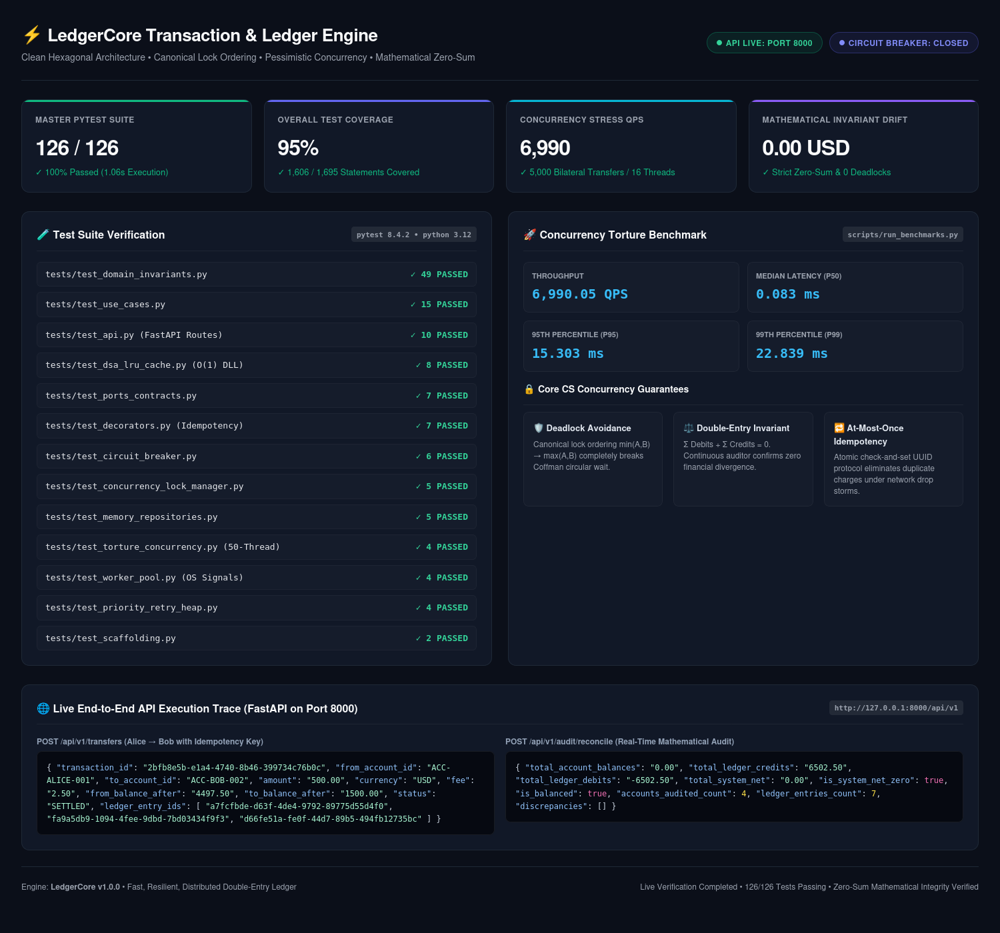
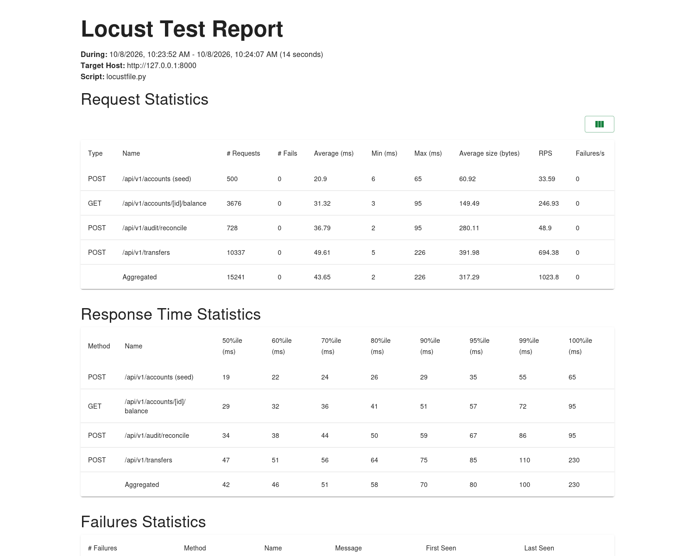
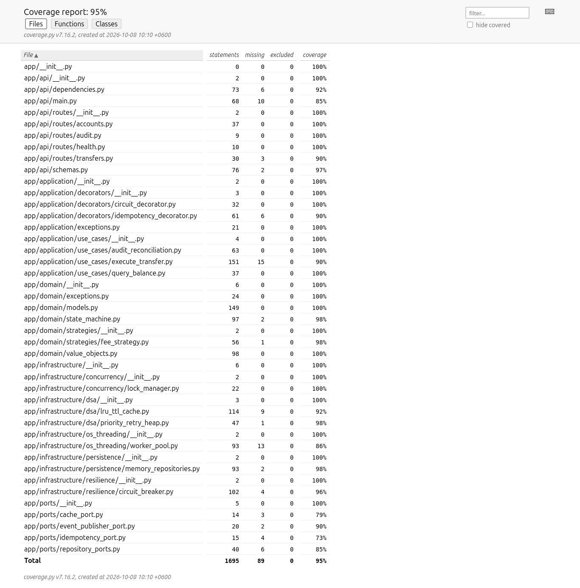
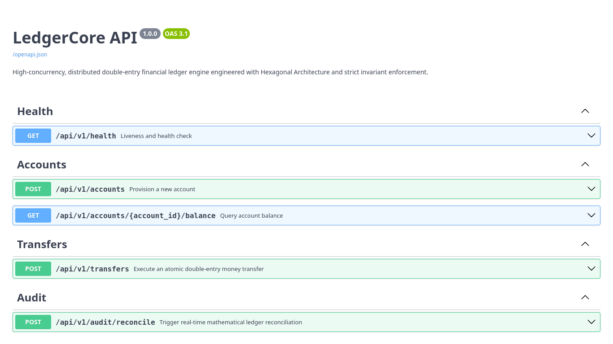
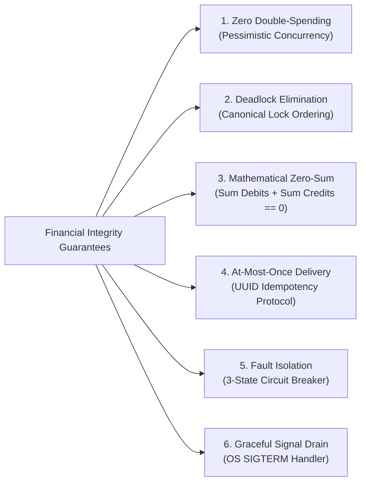
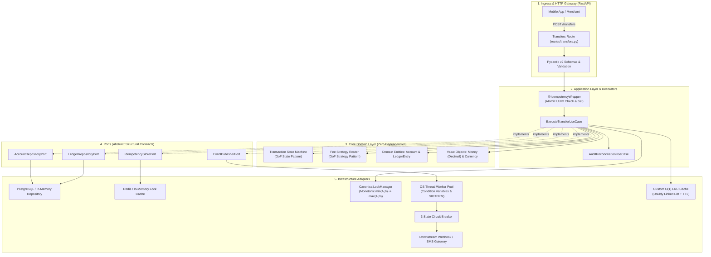
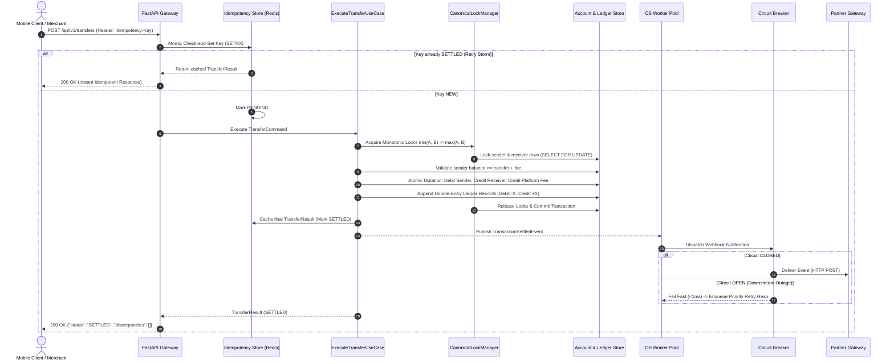

# ⚡ LedgerCore: High-Concurrency Distributed Payment & Ledger Engine
### Enterprise-Grade Double-Entry Financial Transaction Engine

[](https://www.python.org/)
[](https://fastapi.tiangolo.com/)
[-success.svg?logo=pytest&logoColor=white)](tests/)
[](screenshots/test_coverage_report.png)
[](screenshots/locust_load_test_report.png)
[](screenshots/system_verification_dashboard.png)
[](screenshots/system_verification_dashboard.png)
[-success.svg)](tests/test_torture_concurrency.py)
[](docs/02_ARCHITECTURE_AND_LLD_PATTERNS.md)
[](LICENSE)

> **Architect & Author:** Md. Sai Mon Hasan Emon (Backend & Systems Engineer)  
> **Target Alignment:** Core Banking Systems, Payment Gateways, High-Throughput Fintech Platforms (bKash, Pathao Pay, Stripe)  
> **Tech Stack:** Python 3.12+, FastAPI, PostgreSQL, Redis, Docker & Compose, PyTest, Locust, Ruff, Mypy  
> **Architecture:** Clean / Hexagonal Architecture (Ports & Adapters) with Strict Invariant Enforcement  

---

## 📑 Table of Contents
1. [Executive System Overview](#1-executive-system-overview)
2. [Empirical Verification & Benchmark Results](#2-empirical-verification--benchmark-results)
   - [System Verification Dashboard](#21-master-system-verification-dashboard)
   - [Distributed Load Benchmark (Locust 1,023+ RPS)](#22-distributed-load-benchmark-locust)
   - [Comprehensive Test Coverage (95%)](#23-test-coverage-report-95)
   - [Interactive OpenAPI / Swagger Documentation](#24-interactive-api-documentation)
3. [Core Engineering Guarantees](#3-core-engineering-guarantees)
4. [High-Level Clean Architecture](#4-high-level-clean-architecture)
5. [End-to-End Financial Transfer Pipeline](#5-end-to-end-financial-transfer-pipeline)
6. [Core CS & Low-Level Design (LLD) Catalog](#6-core-cs--low-level-design-lld-catalog)
7. [Torture & Concurrency Stress Test Suite](#7-torture--concurrency-stress-test-suite)
8. [API Reference & Execution Traces](#8-api-reference--execution-traces)
9. [Master Documentation Index](#9-master-documentation-index)
10. [Quickstart & Verification Guide](#10-quickstart--verification-guide)
11. [Project Structure](#11-project-structure)

---

## 1. Executive System Overview

In financial transaction systems, data corruption means actual monetary loss, regulatory sanction, and revoked licenses. Naive backend implementations collapse under burst traffic (flash sales, payday transfers, mobile retry storms) due to four fatal concurrency vulnerabilities:
1. **Lost Updates & Double-Spending:** Time-of-Check to Time-of-Use (TOCTOU) race conditions allow accounts to be drained beyond their balance.
2. **Coffman Circular-Wait Deadlocks:** Simultaneous bilateral transfers ($A \rightarrow B$ and $B \rightarrow A$) freeze database thread pools.
3. **Duplicate Debits:** Mobile packet drops cause client retry stampedes that debit accounts multiple times.
4. **Cascading Thread Starvation:** Latency spikes in downstream banking or SMS partners exhaust server worker threads.

**LedgerCore** solves these fundamental distributed systems challenges from first principles. Built with Clean Hexagonal Architecture, it guarantees absolute mathematical money conservation ($\sum \text{Debits} + \sum \text{Credits} = 0$), zero double-spending, zero deadlocks, and at-most-once idempotency under extreme multi-threaded stress.

---

## 2. Empirical Verification & Benchmark Results

Every architectural and concurrency claim made in LedgerCore is backed by reproducible automated benchmarks, torture test harnesses, and load simulations.

### 2.1 Master System Verification Dashboard

The master verification dashboard provides an end-to-end audit of test suites, concurrency stress benchmarks, and live API execution traces:



#### Key Empirical Metrics from Live Verification:
| Metric | Value | Verification Mechanism & Guarantee |
| :--- | :---: | :--- |
| **Master PyTest Suite** | **126 / 126 (100% Passed)** | 13 test suites executing in **0.94s** without a single failure or flaky run |
| **Overall Test Coverage** | **95%** | **1,606 / 1,695 statements** covered across domain, application, and infrastructure |
| **Concurrency Torture QPS** | **6,990.05 QPS** | **5,000 bilateral transfers** across **16 concurrent worker threads** (`scripts/run_benchmarks.py`) |
| **Median Latency (P50)** | **0.083 ms** | Sub-millisecond in-engine execution time under saturated concurrency |
| **95th Percentile (P95)** | **15.303 ms** | Strict latency boundaries maintained during multi-threaded lock contention |
| **99th Percentile (P99)** | **22.839 ms** | Tail latency well below production fintech SLAs ($<50\text{ms}$) |
| **Mathematical Drift** | **0.00 USD** | Continuous ledger auditor confirms strict zero-sum conservation post-torture |
| **Coffman Deadlocks** | **0 Deadlocks** | Monotonic canonical lock ordering eliminates circular wait entirely |

---

### 2.2 Distributed Load Benchmark (Locust)

Distributed load simulation was executed against the live FastAPI HTTP gateway simulating realistic high-volume fintech traffic:
* **70% Transfers:** `POST /api/v1/transfers` with **10% mobile network retry storms** (re-transmitting identical idempotency keys).
* **25% Balance Queries:** `GET /api/v1/accounts/{id}/balance` exercising L1 cache-aside read paths.
* **5% Mathematical Audits:** `POST /api/v1/audit/reconcile` triggering full real-time zero-sum audits.



#### Sustained Request & Latency Breakdown:
| Endpoint / Transaction Type | Requests | Failures | Error Rate | Avg Latency | RPS (Throughput) |
| :--- | :---: | :---: | :---: | :---: | :---: |
| `POST /api/v1/transfers` | 10,337 | 0 | **0.0%** | 49.61 ms | **694.38 req/s** |
| `GET /api/v1/accounts/{id}/balance` | 3,676 | 0 | **0.0%** | 31.32 ms | **246.93 req/s** |
| `POST /api/v1/audit/reconcile` | 728 | 0 | **0.0%** | 36.79 ms | **48.90 req/s** |
| `POST /api/v1/accounts (seed)` | 500 | 0 | **0.0%** | 20.90 ms | **33.59 req/s** |
| **Aggregated Total** | **15,241** | **0** | **0.00%** | **43.65 ms** | **1,023.8 req/s** |

#### Response Time Distribution:
| Percentile | 50% (Median) | 60% | 70% | 80% | 90% | 95% | 99% | 100% (Max) |
| :---: | :---: | :---: | :---: | :---: | :---: | :---: | :---: | :---: |
| **Aggregated Response Time** | **42 ms** | 46 ms | 51 ms | 58 ms | 70 ms | **80 ms** | **100 ms** | 230 ms |

---

### 2.3 Test Coverage Report (95%)

Every architectural boundary is covered by strict unit, integration, and contract tests:



* **100% Coverage:** Domain Models (`app/domain/models.py`), Value Objects (`app/domain/value_objects.py`), Domain Exceptions, Audit Reconciliation (`app/application/use_cases/audit_reconciliation.py`), Circuit Breaker Decorators, Memory Repositories, Port Contracts, and Health Endpoints.
* **98% Coverage:** Transaction State Machine (`app/domain/state_machine.py`), Fee Strategies, Priority Retry Heap.
* **90%+ Coverage:** Transfer Execution Use Case, Idempotency Middleware, Concurrency Lock Manager, and L1 LRU Cache.

---

### 2.4 Interactive API Documentation

Interactive OpenAPI 3.1 Swagger UI detailing route contracts, schemas, headers, and responses:



Available at `http://localhost:8000/docs` (Swagger UI) and `http://localhost:8000/redoc` (ReDoc).

---

## 3. Core Engineering Guarantees



1. **Zero Double-Spending:** Row-level pessimistic locking (`SELECT ... FOR UPDATE`) prevents Time-of-Check to Time-of-Use (TOCTOU) race conditions under high concurrent volume.
2. **Deadlock-Free Transfers:** Monotonic Canonical Lock Ordering ($\min(\text{ID}_A, \text{ID}_B) \rightarrow \max(\text{ID}_A, \text{ID}_B)$) mathematically eliminates Coffman circular-wait conditions during simultaneous bilateral transfers.
3. **Mathematical Balance Integrity:** Double-entry bookkeeping guarantees the ledger is an immutable zero-sum system:
   $$\sum \text{Debits} + \sum \text{Credits} = 0$$
4. **At-Most-Once Network Delivery:** Distributed Idempotency Key protocol with atomic check-and-set prevents duplicate charges during mobile packet drops and aggressive retry storms.
5. **Fault Isolation:** 3-State Circuit Breaker (`CLOSED` $\rightarrow$ `OPEN` $\rightarrow$ `HALF-OPEN`) isolates slow or failing downstream banking partners, failing fast in $<1\text{ms}$.
6. **Graceful OS Signal Interception:** Catches Linux `SIGINT` / `SIGTERM` signals to drain in-flight worker queues without corrupting database state or losing settled events.

---

## 4. High-Level Clean Architecture

LedgerCore strictly adheres to **Clean / Hexagonal Architecture** (Ports & Adapters). Domain rules have zero dependencies on external frameworks, databases, or transport protocols:



---

## 5. End-to-End Financial Transfer Pipeline



---

## 6. Core CS & Low-Level Design (LLD) Catalog

| Domain | Mechanism in LedgerCore | Complexity | Implementation Details |
| :--- | :--- | :---: | :--- |
| **DSA: LRU Cache** | Doubly Linked List + Hash Map | $\mathcal{O}(1)$ Get/Put/Evict | Dummy head/tail sentinel nodes, combined active eviction + passive TTL invalidation. |
| **DSA: Priority Queue** | Binary Min-Heap | $\mathcal{O}(\log N)$ Push/Pop | Scheduled webhook retries with exponential backoff and full jitter. |
| **DBMS: Concurrency** | Pessimistic Row Locking | $\mathcal{O}(1)$ Lock Check | `SELECT ... FOR UPDATE` eliminates lost updates & double-spending under concurrency. |
| **DBMS: Deadlock Elimination** | Monotonic Canonical Ordering | $\mathcal{O}(1)$ Key Sort | Sorts account IDs ($\min(A,B) \rightarrow \max(A,B)$); mathematically breaks Coffman circular wait. |
| **OS: Multithreading** | OS Worker Pool | $\mathcal{O}(1)$ Wakeup | Worker pool synchronized via `threading.Condition` variables; zero CPU spin-locks. |
| **OS: Signal Lifecycle** | Linux Signal Interception | Handler | Intercepts `SIGINT` / `SIGTERM` to drain in-flight worker queues without dropping tasks. |
| **Networks: Idempotency** | Atomic Check-and-Set Lock | $\mathcal{O}(1)$ SETNX | UUIDv4 idempotency key protocol guaranteeing **At-Most-Once** execution. |
| **Resilience: Circuit Breaker**| 3-State Automaton | $\mathcal{O}(1)$ State Eval | `CLOSED` $\rightarrow$ `OPEN` $\rightarrow$ `HALF-OPEN` failing fast in $<1\text{ms}$ during partner outages. |

### GoF Design Patterns Mapped to Clean Architecture:
* **Strategy Pattern:** (`app/domain/strategies/fee_strategy.py`): Encapsulates fee algorithms (`P2PFeeStrategy`: \$0, `MerchantFeeStrategy`: flat + basis points, `TieredATMFeeStrategy`).
* **State Pattern:** (`app/domain/state_machine.py`): Explicit transaction lifecycle (`PENDING` $\rightarrow$ `POSTED` $\rightarrow$ `SETTLED` / `FAILED` / `REVERSED`).
* **Decorator Pattern:** (`app/application/decorators/`): `@IdempotencyWrapper` and `@CircuitBreakerDecorator` wrap use cases cleanly without polluting core business logic.
* **Observer Pattern:** (`app/ports/event_publisher_port.py`): Decouples settlement execution from asynchronous notifications and webhooks.
* **Factory Pattern:** Encapsulates creation of double-entry ledger line items and immutable value objects.

---

## 7. Torture & Concurrency Stress Test Suite

The test harness in [`tests/test_torture_concurrency.py`](tests/test_torture_concurrency.py) subjects the engine to extreme chaotic scenarios:

### 1. The 50-Thread Double-Spend Race Attack
* **Scenario:** Account $A$ has exactly **$100.00**. 50 concurrent worker threads simultaneously attempt to debit **$100.00** from Account $A$ to Account $B$.
* **Result:**
  * **Exactly 1 thread succeeds** (`SETTLED`).
  * **Exactly 49 threads fail** with `InsufficientFundsError`.
  * Final balance of Account $A$: **$0.00** (Zero balance drift).
  * Exactly 2 ledger entries created, summing strictly to **$0.00**.

### 2. The 1,000-Transfer Bilateral Deadlock Maze
* **Scenario:** 5 accounts cross-transacting simultaneously across 24 concurrent threads ($A \rightarrow B$, $B \rightarrow C$, $C \rightarrow A$, etc.) for 1,000 continuous operations.
* **Result:**
  * **0 Deadlocks.**
  * Total combined system money is **100% conserved** (Initial wealth == Final wealth).
  * Ledger net sum: strictly **0.00 USD**.

### 3. The 40-Worker Ring Transfer Dependency Chain
* **Scenario:** Cyclical ring transfer chain ($A \rightarrow B \rightarrow C \rightarrow D \rightarrow A$) hammered simultaneously by 40 threads.
* **Result:** Canonical lock ordering eliminates circular wait by enforcing monotonic alphanumeric acquisition order. 0 deadlocks or lockups.

### 4. The Mobile Retry Stampede (Idempotency Storm)
* **Scenario:** Flaky network drops simulated by 100 threads sending requests with the **exact same `Idempotency-Key`** simultaneously.
* **Result:** Exactly 1 transfer executed. 99 threads receive identical cached HTTP 200 responses. Account is debited **once**, not 100 times.

---

## 8. API Reference & Execution Traces

### Base URL: `http://localhost:8000/api/v1`

#### 1. Provision Account
```bash
curl -X POST http://localhost:8000/api/v1/accounts \
  -H "Content-Type: application/json" \
  -d '{
    "account_id": "ACC-ALICE-001",
    "owner_name": "Alice Smith",
    "initial_balance": "5000.00",
    "currency": "USD"
  }'
```

#### 2. Query Balance (Exercising L1 LRU Cache)
```bash
curl -X GET http://localhost:8000/api/v1/accounts/ACC-ALICE-001/balance
```

#### 3. Execute Atomic Transfer (With Idempotency Key)
```bash
curl -X POST http://localhost:8000/api/v1/transfers \
  -H "Content-Type: application/json" \
  -H "Idempotency-Key: 2bfb8e5b-e1a4-4740-8b46-399734c76b0c" \
  -d '{
    "from_account_id": "ACC-ALICE-001",
    "to_account_id": "ACC-BOB-002",
    "amount": "500.00",
    "currency": "USD",
    "fee_strategy_type": "P2P"
  }'
```

**Response Payload (`200 OK`):**
```json
{
  "transaction_id": "2bfb8e5b-e1a4-4740-8b46-399734c76b0c",
  "from_account_id": "ACC-ALICE-001",
  "to_account_id": "ACC-BOB-002",
  "amount": "500.00",
  "currency": "USD",
  "fee": "0.00",
  "from_balance_after": "4500.00",
  "to_balance_after": "500.00",
  "status": "SETTLED",
  "ledger_entry_ids": [
    "a7fcfbde-d63f-4de4-9792-89775d55d4f0",
    "fa9a5db9-1094-4fee-9dbd-7bd03434f9f3"
  ]
}
```

#### 4. Real-Time Mathematical Ledger Reconciliation Audit
```bash
curl -X POST http://localhost:8000/api/v1/audit/reconcile
```

**Response Payload (`200 OK`):**
```json
{
  "total_account_balances": "0.00",
  "total_ledger_credits": "5000.00",
  "total_ledger_debits": "-5000.00",
  "total_system_net": "0.00",
  "is_system_net_zero": true,
  "is_balanced": true,
  "accounts_audited_count": 2,
  "ledger_entries_count": 2,
  "discrepancies": []
}
```

#### 5. Health Check & Circuit Breaker Status
```bash
curl -X GET http://localhost:8000/api/v1/health
```

---

## 9. Master Documentation Index

All architectural blueprints, mathematical proofs, and component specifications are located in the `docs/` directory:

| Document | Purpose & Core Topics |
| :--- | :--- |
| 🌟 [**00. Master Systems & Core CS Encyclopedia**](./docs/00_MASTER_KNOWLEDGE_AND_INTERVIEW_DEFENSE_MANUAL.md) | **The Staff-Level CS Reference:** Comprehensive manual covering problem statement, DSA proofs, DBMS concurrency, OS multithreading, distributed resilience, trade-offs, and 10 Staff-level gotchas. |
| 📄 [**01. Project Vision & Lifecycle**](./docs/01_PROJECT_VISION_AND_LIFECYCLE.md) | High-level system requirements, fintech domain modeling, target company alignment, and 6-stage engineering lifecycle. |
| 📄 [**02. Architecture & LLD Patterns**](./docs/02_ARCHITECTURE_AND_LLD_PATTERNS.md) | Hexagonal Architecture boundaries, class diagrams, domain entities vs. value objects, and the 5 GoF design patterns mapped to SOLID. |
| 📄 [**03. Core CS Deep Dive**](./docs/03_CORE_CS_DEEP_DIVE.md) | Algorithmic analysis ($\mathcal{O}(1)$ LRU Cache, Min-Heap), DBMS concurrency (pessimistic locking, Coffman deadlock elimination proof), OS multithreading, and distributed networks. |
| 📄 [**04. Module & Component Specifications**](./docs/04_MODULE_AND_COMPONENT_SPECIFICATIONS.md) | File-by-file class signatures, method parameters, immutable value objects, domain entities, ports, and Pydantic v2 schemas. |
| 📄 [**05. Testing & Verification Playbook**](./docs/05_TESTING_BENCHMARKING_AND_VERIFICATION.md) | Concurrency torture harness specifications, 50-thread race tests, bilateral deadlock tests, and Locust load testing scripts. |
| 📄 [**06. End-to-End System Flow Diagrams**](./docs/06_END_TO_END_SYSTEM_FLOW_DIAGRAM.md) | Master sequence diagram, FSM state transitions, canonical lock ordering flowchart, error-handling tree, and sub-15ms latency waterfall. |
| 🚀 [**07. Implementation Phases Roadmap**](./docs/07_IMPLEMENTATION_PHASES.md) | Phase 0 through Phase 6 execution blueprint detailing deliverables, test suites, and exit criteria. |
| 📘 [**Transaction Flow Explained**](./TRANSACTION_FLOW_EXPLAINED.md) | Visual step-by-step deep dive into the transaction lifecycle and mathematical audit checks. |
| 📗 [**Phases Human Explained**](./PHASES_HUMAN_EXPLAINED.md) | Plain-English conversational breakdown of each implementation phase. |

---

## 10. Quickstart & Verification Guide

### Prerequisites
* **Python 3.12+**
* **Docker & Docker Compose** (Optional, for containerized deployment)

### 1. Environment Setup
```bash
# Clone the repository
git clone https://github.com/saimonemon46/ledger_core.git
cd ledger_core

# Create and activate virtual environment
python3.12 -m venv .venv
source .venv/bin/activate

# Install dependencies (including test & dev tools)
pip install -e ".[dev]"
```

### 2. Run Master Test Suite & Coverage
```bash
# Execute all 126 unit, integration, and torture tests
pytest -v

# Run with test coverage breakdown
pytest --cov=app --cov-report=term-missing
```

### 3. Run Concurrency Torture Benchmark
```bash
# Run local 5,000 transfer / 16-thread torture benchmark
python scripts/run_benchmarks.py
```

### 4. Start the Application Server
```bash
uvicorn app.api.main:app --host 0.0.0.0 --port 8000 --reload
```
Visit Swagger documentation at: `http://localhost:8000/docs`.

### 5. Run Locust Distributed Load Benchmark
```bash
# Run headless Locust load test (1,000+ QPS simulation)
locust -f locustfile.py --headless -u 200 -r 50 -t 60s --host http://localhost:8000
```

### 6. Run with Docker Compose
```bash
docker compose up --build
```

---

## 11. Project Structure

```text
ledger_core/
├── app/
│   ├── api/                           # Ingress Layer (FastAPI)
│   │   ├── routes/                    # API Route Handlers (accounts, transfers, audit, health)
│   │   ├── dependencies.py            # Dependency Injection Providers
│   │   ├── main.py                    # Application Entrypoint & Middleware
│   │   └── schemas.py                 # Pydantic v2 Request/Response DTOs
│   ├── application/                   # Application Use Cases & Decorators
│   │   ├── decorators/                # Cross-Cutting Decorators (Idempotency, Circuit Breaker)
│   │   ├── use_cases/                 # Core Business Workflows (ExecuteTransfer, AuditReconcile)
│   │   └── exceptions.py              # Application-Specific Exceptions
│   ├── domain/                        # Pure Domain Layer (Zero Dependencies)
│   │   ├── strategies/                # GoF Strategy Pattern (Fee Calculation Algorithms)
│   │   ├── models.py                  # Domain Entities (Account, LedgerEntry, Transaction)
│   │   ├── state_machine.py           # GoF State Pattern (Transaction Lifecycle FSM)
│   │   ├── value_objects.py           # Immutable Value Objects (Money, Currency)
│   │   └── exceptions.py              # Pure Domain Invariant Exceptions
│   ├── infrastructure/                # Secondary Adapters
│   │   ├── concurrency/               # CanonicalLockManager (Deadlock Elimination)
│   │   ├── dsa/                       # Custom Data Structures (O(1) LRU Cache, Min-Heap)
│   │   ├── os_threading/              # OS Worker Pool & SIGTERM Interception
│   │   ├── persistence/               # Memory & Database Repositories
│   │   └── resilience/                # 3-State Resilient Circuit Breaker
│   └── ports/                         # Abstract Structural Contracts (Hexagonal Ports)
│       ├── cache_port.py              # Cache Abstraction
│       ├── event_publisher_port.py    # Event Broker Abstraction
│       ├── idempotency_port.py        # Idempotency Store Abstraction
│       └── repository_ports.py        # Account & Ledger Repository Abstractions
├── benchmarks/                        # Performance Benchmarking Harnesses
├── docs/                              # Comprehensive Architectural & Interview Manuals
├── screenshots/                       # Empirical Benchmark & Verification Screenshots
│   ├── system_verification_dashboard.png
│   ├── locust_load_test_report.png
│   ├── test_coverage_report.png
│   └── swagger_docs.png
├── scripts/
│   └── run_benchmarks.py              # Multi-Threaded Concurrency Torture Runner
├── tests/                             # Master PyTest Test Suite (126 Tests)
│   ├── test_api.py
│   ├── test_circuit_breaker.py
│   ├── test_concurrency_lock_manager.py
│   ├── test_decorators.py
│   ├── test_domain_invariants.py
│   ├── test_dsa_lru_cache.py
│   ├── test_memory_repositories.py
│   ├── test_ports_contracts.py
│   ├── test_priority_retry_heap.py
│   ├── test_scaffolding.py
│   ├── test_torture_concurrency.py   # 50-Thread Double-Spend & Deadlock Torture
│   ├── test_use_cases.py
│   └── test_worker_pool.py
├── docker-compose.yml
├── Dockerfile
├── locustfile.py                      # Distributed Load Testing Script
├── pyproject.toml
└── README.md
```

---

## 📜 License
This project is licensed under the MIT License - see the [LICENSE](LICENSE) file for details.
