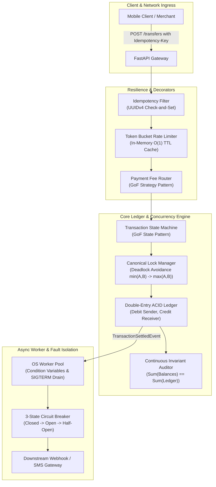

# LedgerCore: High-Concurrency Distributed Payment & Ledger Engine
## Enterprise-Grade Double-Entry Financial Transaction Engine

> **Author:** Md. Sai Mon Hasan Emon (Backend & Systems Engineer)  
> **Tech Stack:** Python 3.12+, FastAPI, PostgreSQL, Redis, Docker, PyTest, Locust  
> **Architecture:** Clean / Hexagonal Architecture (Ports & Adapters)  

---

## 1. System Overview

**LedgerCore** is a high-throughput, distributed payment processing and financial ledger engine built from first principles. It models the core transaction engine of modern fintech platforms like **bKash** and **Pathao Pay**.

### Core Engineering Guarantees:
1. **Zero Double-Spending:** Row-level pessimistic locking (`SELECT ... FOR UPDATE`) prevents Time-of-Check to Time-of-Use (TOCTOU) race conditions under high concurrency.
2. **Deadlock-Free Transfers:** Canonical Global Lock Ordering ($\min(\text{ID}_A, \text{ID}_B) \rightarrow \max(\text{ID}_A, \text{ID}_B)$) eliminates Coffman circular-wait deadlocks during simultaneous bilateral transfers.
3. **Mathematical Balance Integrity:** Double-entry bookkeeping guarantees that the ledger is zero-sum:
   $$\sum \text{Debits} + \sum \text{Credits} = 0$$
4. **At-Most-Once Network Delivery:** Idempotency Key protocol with atomic check-and-set prevents duplicate charges during mobile network drops and retry storms.
5. **Fault Isolation:** 3-State Circuit Breaker (`CLOSED` $\rightarrow$ `OPEN` $\rightarrow$ `HALF-OPEN`) isolates slow downstream systems, failing fast in $<1\text{ms}$.
6. **Graceful OS Signal Interception:** Intercepts Linux `SIGINT` / `SIGTERM` signals to drain in-flight worker queues without corrupting database state.

---

## 2. High-Level System Architecture



---

## 3. Master Documentation Index

All architectural blueprints, mathematical proofs, and component specifications are documented in the `docs/` directory:

| Document | Purpose & Core Topics |
| :--- | :--- |
| 🌟 [**00. Master Knowledge & Interview Defense Manual**](./docs/00_MASTER_KNOWLEDGE_AND_INTERVIEW_DEFENSE_MANUAL.md) | **The Core CS & LLD Encyclopedia:** Complete mastery manual covering purpose, problem, solution, achievements, DSA proofs, DBMS concurrency, OS multithreading, distributed resilience, trade-offs, and 10 Staff-level interview gotchas. |
| 📄 [**01. Project Vision & Lifecycle**](./docs/01_PROJECT_VISION_AND_LIFECYCLE.md) | System problem statement, target company alignment (Pathao, bKash, Optimizely), scope boundaries, and the 6-stage engineering lifecycle. |
| 📄 [**02. Architecture & LLD Patterns**](./docs/02_ARCHITECTURE_AND_LLD_PATTERNS.md) | Clean/Hexagonal Architecture boundaries, detailed class diagrams, and the 5 GoF patterns (Strategy, State Machine, Decorator, Observer, Factory) mapped to SOLID. |
| 📄 [**03. Core CS Deep Dive**](./docs/03_CORE_CS_DEEP_DIVE.md) | Algorithmic analysis ($\mathcal{O}(1)$ LRU Cache, Min-Heap), DBMS concurrency (pessimistic locking, Coffman deadlock elimination proof), OS multithreading, and distributed networks. |
| 📄 [**04. Module & Component Specifications**](./docs/04_MODULE_AND_COMPONENT_SPECIFICATIONS.md) | Exhaustive file-by-file class signatures, method parameters, immutable value objects, domain entities, ports, use cases, and Pydantic v2 schemas. |
| 📄 [**05. Testing & Verification Playbook**](./docs/05_TESTING_BENCHMARKING_AND_VERIFICATION.md) | 50-thread race condition stress tests, 1,000 bilateral transfer deadlock tests, Locust load benchmarks (1,000+ QPS), and live interview defense scripts. |
| 📄 [**06. End-to-End System Flow Diagrams**](./docs/06_END_TO_END_SYSTEM_FLOW_DIAGRAM.md) | Master sequence diagram, finite state machine transitions, canonical lock ordering deadlock elimination flowchart, error-handling tree, and sub-15ms latency waterfall analysis. |
| 🚀 [**07. Implementation Phases Roadmap**](./docs/07_IMPLEMENTATION_PHASES.md) | **Step-by-Step Implementation Blueprint:** Exhaustive Phase 0 through Phase 6 roadmap detailing deliverables, CS mechanisms, test suites, and exit criteria. |

---

## 4. Core CS & Design Pattern Catalog

| Core CS Domain | Implementation in LedgerCore | Big-O Complexity |
| :--- | :--- | :---: |
| **DSA: LRU Cache** | Doubly Linked List + Hash Map with dummy sentinels and active/passive TTL. | $\mathcal{O}(1)$ Get/Put/Evict |
| **DSA: Retry Heap** | Binary Min-Heap managing delayed webhook retries with exponential backoff. | $\mathcal{O}(\log N)$ Push/Pop |
| **DBMS: Concurrency** | Row-level pessimistic locking (`SELECT ... FOR UPDATE`) preventing lost updates. | $\mathcal{O}(1)$ Lock Check |
| **DBMS: Deadlocks** | Canonical Global Lock Ordering ($\min(A,B) \rightarrow \max(A,B)$) eliminating circular wait. | $\mathcal{O}(1)$ Key Sort |
| **OS: Worker Pool** | Thread synchronization via `threading.Condition` variables; zero CPU spin-locks. | $\mathcal{O}(1)$ Task Wakeup |
| **Networks: Idempotency** | UUIDv4 check-and-set protocol guaranteeing At-Most-Once transaction processing. | $\mathcal{O}(1)$ Redis SETNX |
| **Networks: Circuit Breaker** | 3-state automaton (`CLOSED`/`OPEN`/`HALF-OPEN`) with sliding-window failure metrics. | $\mathcal{O}(1)$ Evaluation |

---

## 5. Quickstart & Verification (Coming with Phase 1-5 Implementation)

### Run Master Test Suite:
```bash
pytest tests/ -v
```

### Run Concurrency Stress Tests:
```bash
pytest tests/test_concurrency_race.py tests/test_deadlock_elimination.py -v
```

### Run High-Throughput Locust Benchmark:
```bash
locust -f benchmarks/locustfile.py --headless -u 200 -r 50 -t 60s --host http://localhost:8000
```
