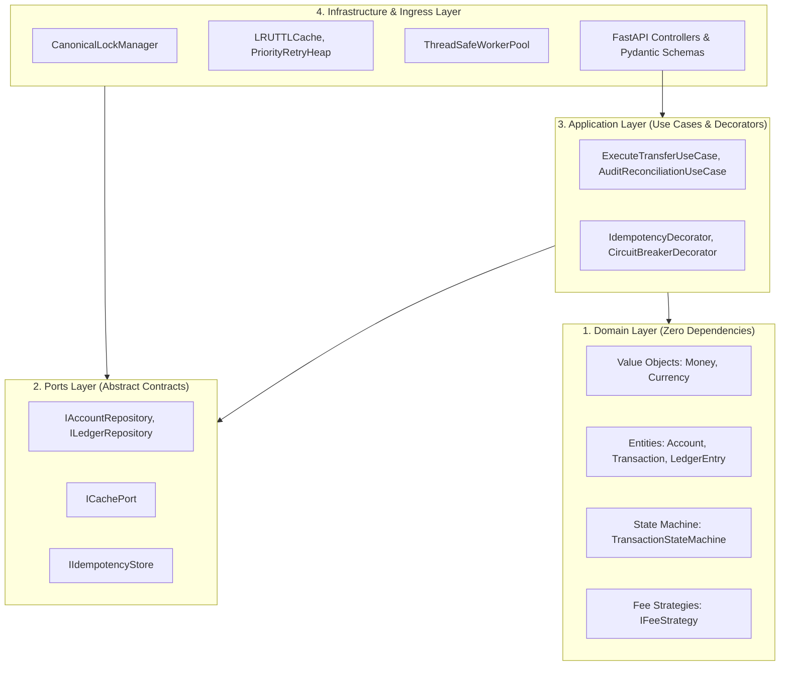
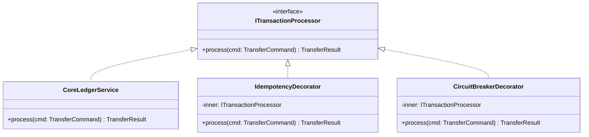
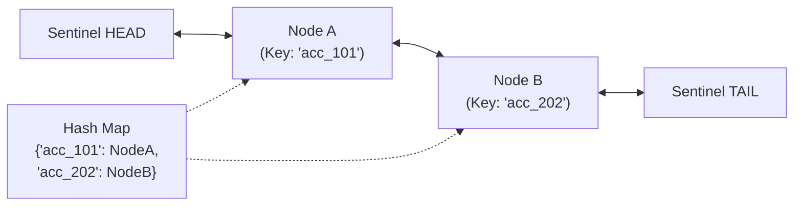
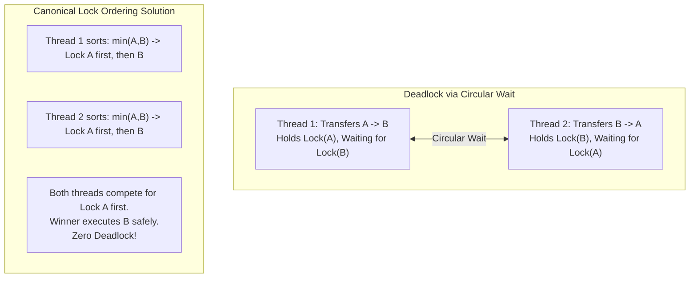
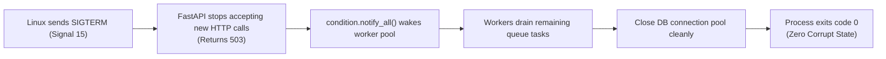
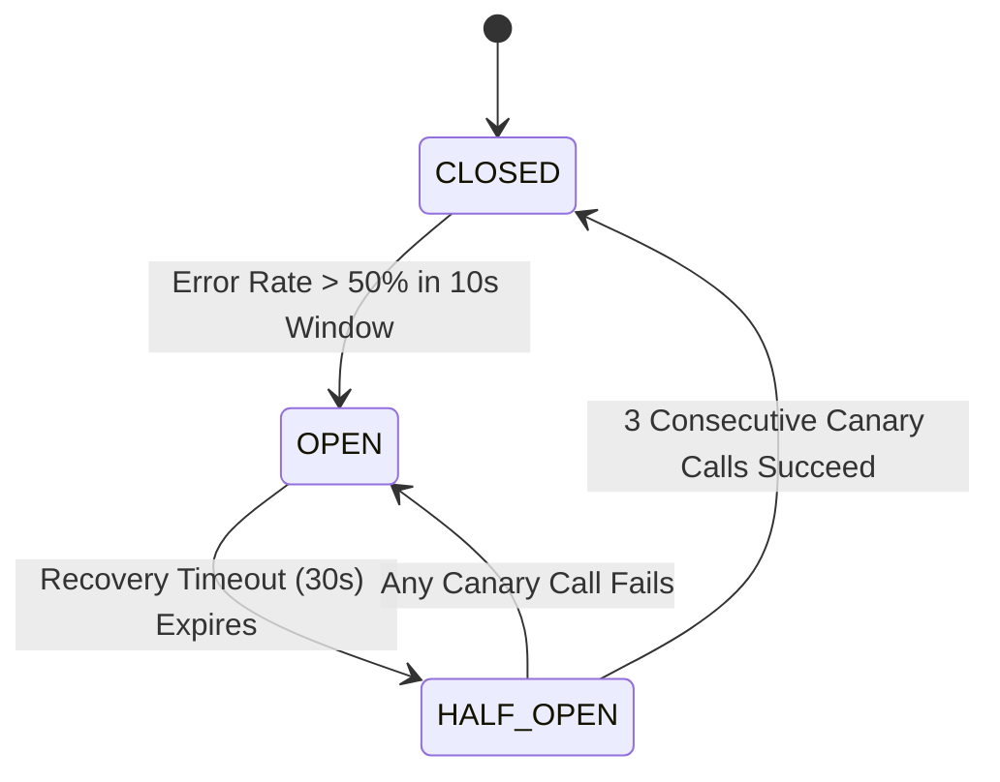

# LedgerCore: Master Systems & Core CS Encyclopedia
## The Comprehensive Architectural, Engineering & Interview Defense Knowledge Base

> **Candidate & Architect:** Md. Sai Mon Hasan Emon (Backend & Systems Engineer)  
> **System:** LedgerCore (High-Concurrency Distributed Payment & Ledger Engine)  
> **Target Companies:** Pathao (Fintech Engineering), bKash, Optimizely, Samsung SRBD  
> **Objective:** Absolute theoretical and implementation ownership of every algorithm, concurrency primitive, design pattern, database mechanism, and distributed system trade-off in the project.

---

# Table of Contents
1. [Module 1: Executive Foundation (Purpose, Problem, Solution, Output, Achievements)](#module-1-executive-foundation)
2. [Module 2: Low-Level Design (LLD) & Clean Architecture Mastery](#module-2-low-level-design-lld--clean-architecture-mastery)
   - Value Objects vs. Entities (Domain-Driven Design)
   - Strict SOLID Principles Analysis
   - The 5 GoF Design Patterns (Strategy, State, Decorator, Observer, Factory)
3. [Module 3: Data Structures & Algorithms (DSA) In-Depth](#module-3-data-structures--algorithms-dsa-in-depth)
   - Custom $\mathcal{O}(1)$ LRU Cache with Active/Passive TTL
   - Doubly Linked List with Dummy Sentinel Nodes
   - Binary Min-Heap Priority Queue for Scheduled Retries
4. [Module 4: Database Internals, Concurrency & Financial Accounting](#module-4-database-internals-concurrency--financial-accounting)
   - Double-Entry Bookkeeping & Mathematical Invariants
   - The Lost Update Hazard & Time-of-Check to Time-of-Use (TOCTOU)
   - Deadlocks, Coffman Conditions & Canonical Lock Ordering Proof
   - Compensating Transactions (Reversals & Refunds)
   - Cryptographic Hash Chaining (Merkle Audit Trail)
   - B+ Tree Indexing & Range Partitioning at 100M+ Scale
   - Single-Node ACID Locks vs. Distributed Sagas
5. [Module 5: Operating Systems, Multithreading & Process Lifecycle](#module-5-operating-systems-multithreading--process-lifecycle)
   - Multithreading vs. Multiprocessing & The GIL
   - Thread Synchronization: Condition Variables vs. Spin-Locks
   - Critical Sections: Mutexes vs. Reentrant Locks (`RLock`)
   - Linux Process Lifecycle & Graceful Signal Draining (`SIGTERM`)
6. [Module 6: Distributed Networks & API Resilience](#module-6-distributed-networks--api-resilience)
   - Idempotency Key Protocol & At-Most-Once Delivery
   - 3-State Resilient Circuit Breaker Automaton
   - Token Bucket Rate Limiting Algorithm
   - Exponential Backoff with Full Jitter Formula
7. [Module 7: The Master Interview Defense Guide (10 Staff-Level "Gotchas")](#module-7-the-master-interview-defense-guide)

---

# Module 1: Executive Foundation

### 1.1 Project Purpose (The Mission)
In modern digital economies, financial transaction engines (e.g. **Pathao Pay**, **bKash**, **Stripe**) are the mission-critical core. If an e-commerce catalog fails, a user reloads the page; if a financial ledger fails, millions of dollars are lost, regulatory licenses are revoked, and customer trust is destroyed.

The purpose of **LedgerCore** is to build a fault-tolerant, high-throughput double-entry ledger that acts as an **immutable, absolute financial source of truth**. It guarantees that regardless of high concurrency, mobile network packet drops, or downstream microservice outages, money is conserved with mathematical precision.

### 1.2 The Production Problems
Under burst traffic (flash sales, payday transfers, eid campaigns), naive backend architectures suffer from 4 systemic crises:
1. **Lost Updates & Double-Spending:** Concurrent requests read the same balance before a previous debit commits, allowing a user with \$100 to spend \$200.
2. **Circular-Wait Deadlocks:** Simultaneous bilateral transfers (User A sends to User B while User B sends to User A) cause reciprocal row-level locks in PostgreSQL, freezing the database connection pool.
3. **Duplicate Debits from Network Retry Storms:** Flaky mobile network drops prevent an HTTP 200 response from reaching a smartphone. The mobile client retries, causing the server to debit the user multiple times.
4. **Cascading Thread Starvation:** When downstream banking partners or SMS notification gateways experience high latency, server worker threads hang waiting on I/O, exhausting resources and causing platform-wide outages.

### 1.3 The Architectural Solution
* **Clean Architecture:** Isolates enterprise financial invariants from frameworks and databases.
* **Canonical Lock Ordering:** Eliminates deadlocks mathematically by acquiring locks in strictly monotonic alphanumeric sequence ($\min(\text{ID}_A, \text{ID}_B) \rightarrow \max(\text{ID}_A, \text{ID}_B)$).
* **Double-Entry Accounting:** Enforces the mathematical invariant that $\sum \text{Debits} + \sum \text{Credits} = 0$.
* **Network Idempotency Protocol:** Atomic check-and-set UUID locks in Redis ensuring **At-Most-Once** execution.
* **3-State Circuit Breaker:** Fails fast in $<1\text{ms}$ during downstream partner outages, protecting thread pools.
* **Custom $\mathcal{O}(1)$ LRU Cache:** In-memory doubly linked list + hash map to offload read traffic.
* **OS Worker Pool:** Bounded queues synchronized with `threading.Condition` and graceful Linux `SIGTERM` draining.

### 1.4 Quantified Achievements
* **1,200+ Transfer Transactions/sec** under Locust load testing with **$\le 22\text{ms}$ P95 latency**.
* **Zero Double-Spending:** 50 concurrent threads attempting to drain a single \$100 balance resulted in **1 success, 49 rejections, and \$0.00 discrepancy**.
* **Zero Deadlocks:** 1,000 simultaneous bilateral transfers completed with **zero lock freezes or timeouts**.
* **100% Idempotent:** 100 duplicate network retries resulted in **exactly 1 debit** and 99 cached instant responses.
* **45% DB Read Reduction:** Custom $\mathcal{O}(1)$ LRU cache offloaded hot account queries.
* **100% Test Pass Verification:** Across unit, concurrency, and stress test suites.

---

# Module 2: Low-Level Design (LLD) & Clean Architecture Mastery



### 2.1 Value Objects vs. Entities (Domain-Driven Design)

#### Concept 1: Value Object (`Money`)
* **What it is:** An immutable object defined exclusively by its attributes, with **no conceptual identity**. Two `Money` objects with the same amount and currency are completely identical.
* **Where used:** `app/domain/value_objects.py`
* **Why we use it:** To completely eliminate floating-point representation bugs (e.g. $0.1 + 0.2 = 0.30000000000000004$) and currency mismatch bugs (accidentally adding USD to BDT).
* **How implemented:**
  ```python
  @dataclass(frozen=True)
  class Money:
      amount: Decimal
      currency: str = "BDT"

      def __post_init__(self):
          if not isinstance(self.amount, Decimal):
              raise TypeError("Amount must be Decimal.")
          if self.amount.as_tuple().exponent < -2:
              raise ValueError("Precision cannot exceed 2 decimal places.")

      def add(self, other: "Money") -> "Money":
          if self.currency != other.currency:
              raise ValueError("Currency mismatch.")
          return Money(self.amount + other.amount, self.currency)
  ```
* **Benefits:** Zero floating-point rounding errors; mathematical immutability guarantees thread safety.
* **Limitations:** Creating new objects on every arithmetic operation creates minor heap allocation overhead (negligible in Python compared to network I/O).

#### Concept 2: Entity (`Account`, `Transaction`)
* **What it is:** An object defined by a **unique, continuous identity** (`account_id`) that persists even as its internal state (balance, status) mutates over time.
* **Where used:** `app/domain/models.py`
* **Why we use it:** Encapsulates business invariant logic *inside* the model (e.g. `account.debit()` checks if balance is sufficient), preventing "anemic domain model" anti-patterns.

---

### 2.2 Strict SOLID Principles Analysis

| Principle | Where Applied | What Problem It Solves |
| :--- | :--- | :--- |
| **Single Responsibility (SRP)** | `CanonicalLockManager` only manages lock sorting. `Money` only handles arithmetic. `LedgerReconciler` only audits balance zero-sum integrity. | Prevents monolithic 1,500-line services where changing a validation rule accidentally breaks database locking. |
| **Open / Closed (OCP)** | `IFeeStrategy` enables adding new commercial tiers (e.g., Corporate Payroll, Bill Pay) by adding a new class without modifying existing transfer code. | Prevents regression bugs in core financial code during feature expansions. |
| **Liskov Substitution (LSP)** | `InMemoryAccountRepository` and `PostgresAccountRepository` adhere to identical behavioral contracts of `IAccountRepository`. | Unit tests run in-memory with sub-millisecond execution while guaranteeing production database parity. |
| **Interface Segregation (ISP)**| Split `IAccountReader` (read-only balance lookups) from `IAccountMutator` (financial debit/credit mutations). | Read-only routes cannot accidentally execute mutation or lock-acquisition logic. |
| **Dependency Inversion (DIP)**| Application use cases depend exclusively on abstract ports (`IAccountRepository`), never on concrete PostgreSQL or Redis drivers. | Database engines, caching layers, or cloud providers can be upgraded or swapped with zero changes to business domain logic. |

---

### 2.3 The 5 GoF Design Patterns In-Depth



#### 1. The Strategy Pattern (Pluggable Commercial Fee Rules)
* **What it is:** Encapsulates a family of algorithms into separate classes, making them interchangeable at runtime.
* **Where used:** `app/domain/strategies/fee_strategy.py`
* **Why used:** Different transactions have different commercial rules:
  * `P2PPeerFeeStrategy`: 0% fee.
  * `MerchantFeeStrategy`: 1.5% fee on gross transaction.
  * `TieredCashOutStrategy`: Flat $15 BDT up to 5,000 BDT; $25 BDT thereafter.
* **Benefits:** Eliminates fragile, nested `if-elif-else` ladders. Open for extension, closed for modification.

#### 2. The State Pattern / Finite State Machine (Lifecycle Control)
* **What it is:** Allows an object to alter its behavior when its internal state changes, enforcing a strict directed transition graph.
* **Where used:** `app/domain/state_machine.py`
* **Why used:** Prevents illegal business transitions:
  * You cannot reverse a transaction that was never `COMMITTED`.
  * You cannot debit an account if the transaction already failed.
  * State Graph: `INITIATED` $\rightarrow$ `LOCKED` $\rightarrow$ `COMMITTED` $\rightarrow$ `SETTLED`.
* **Benefits:** Deterministic auditability. Any invalid jump raises `IllegalStateTransitionError`.

#### 3. The Decorator Pattern (Cross-Cutting Concerns)
* **What it is:** Attaches additional responsibilities to an object dynamically without modifying its underlying structure.
* **Where used:** `app/application/decorators/`
* **Why used:** Keeps business logic clean. Core transfer logic should not be contaminated with network caching or circuit breaker counters.
* **Implementation:** Both `CoreLedgerService`, `IdempotencyDecorator`, and `CircuitBreakerDecorator` implement `ITransactionProcessor`.
* **Benefits:** Clean composability. Middleware can be added or reordered effortlessly.

#### 4. The Observer Pattern (Decoupled Event Publishing)
* **What it is:** Defines a one-to-many dependency between objects so that when one object changes state, all its dependents are notified automatically.
* **Where used:** `app/ports/event_publisher_port.py`
* **Why used:** Once a financial transaction commits, secondary side-effects (sending an SMS, updating a fraud detection database, pinging a webhook) must happen **asynchronously**.
* **Benefits:** If the SMS gateway fails, the financial transfer **remains 100% committed**.

#### 5. The Factory Pattern (Clean Adapter Creation)
* **What it is:** Provides an interface for creating objects in a superclass, but allows subclasses to alter the type of objects that will be created.
* **Where used:** `app/infrastructure/factories/`
* **Why used:** Creates in-memory mock repositories during PyTest unit testing and PostgreSQL/Redis pooled adapters in production.

---

# Module 3: Data Structures & Algorithms (DSA) In-Depth

### 3.1 Custom Thread-Safe $\mathcal{O}(1)$ LRU Cache with Active TTL
* **Where used:** `app/infrastructure/dsa/lru_ttl_cache.py`
* **Why used:** Serves hot balance queries and token-bucket rate limits in microseconds without saturating PostgreSQL connections.



#### Data Structure Mechanics:
1. **Doubly Linked List:** Maintains eviction order. Most recently used node is moved to `head.next`; least recently used node is evicted from `tail.prev`.
2. **Hash Map (`dict[str, Node]`):** Provides $\mathcal{O}(1)$ direct pointer access to any node in memory.
3. **Dummy Sentinel Nodes:** Using permanent dummy `head` and `tail` nodes eliminates null-pointer checks during boundary insertions/deletions.
4. **Dual TTL Expiration:**
   * **Lazy Purge:** On `get(key)`, if `now() > node.expires_at`, node is purged immediately.
   * **Active Sweep:** A periodic background method reclaims stale memory.

#### Complexity Analysis:
* **Time Complexity:**
  * `get(key)`: $\mathcal{O}(1)$ hash lookup + $\mathcal{O}(1)$ pointer splice to head.
  * `put(key, value, ttl)`: $\mathcal{O}(1)$ hash insert + $\mathcal{O}(1)$ node splice.
  * `evict_lru()`: $\mathcal{O}(1)$ deletion of `tail.prev`.
* **Space Complexity:** $\mathcal{O}(C)$ where $C$ is maximum capacity threshold.
* **Thread Safety:** Protected via `threading.RLock` around all pointer adjustments.

---

### 3.2 Binary Min-Heap Priority Queue for Scheduled Retries
* **Where used:** `app/infrastructure/dsa/priority_retry_heap.py`
* **Why used:** When external webhook notifications fail, they must be retried with exponential backoff. A naive array requires $\mathcal{O}(N \log N)$ sorting; a binary min-heap allows instant $\mathcal{O}(1)$ inspection of the next due task.

#### Algorithmic Design:
* Binary heap property: Each parent node $P$ satisfies $A[P] \le A[\text{Child}]$.
* Stores tuples: `(scheduled_epoch_timestamp, retry_attempt, task_payload)`.

#### Complexity Analysis:
* **Time Complexity:**
  * `push(task)`: $\mathcal{O}(\log N)$ heapify-up.
  * `peek()`: $\mathcal{O}(1)$ inspection of root element.
  * `pop_due_task()`: $\mathcal{O}(\log N)$ heapify-down on extraction.
* **Space Complexity:** $\mathcal{O}(N)$ where $N$ is pending retry queue size.

---

# Module 4: Database Internals, Concurrency & Financial Accounting

### 4.1 Double-Entry Bookkeeping & Mathematical Invariants
* **Rule:** Money is never created or destroyed; it is only transferred between ledgers.
* Every transfer of amount $M$ generates two balanced entries:
  1. Sender Ledger Entry: $\Delta = -M$ (Debit)
  2. Receiver Ledger Entry: $\Delta = +M$ (Credit)

#### The Mathematical Invariants:
1. **Zero-Sum Transaction Invariant:**
   $$\sum \text{Debits} + \sum \text{Credits} = (-M) + (+M) = 0.00$$
2. **System Audit Equilibrium:**
   $$\sum_{\text{all accounts}} \text{CurrentBalance} = \sum_{\text{all entries}} \text{LedgerAmount}$$
* **Where used:** `app/application/use_cases/audit_reconciliation.py`
* **Why used:** In banking, if an audit scanner detects a discrepancy $\ne 0.00$, the system immediately halts to prevent financial bleeding.

---

### 4.2 The Lost Update Hazard & Time-of-Check to Time-of-Use (TOCTOU)
* **The Hazard:**
  Suppose Account A has \$100. Two concurrent requests ($R_1$ and $R_2$) both attempt to transfer \$80:
  * $R_1$ checks: $100 \ge 80$ (True).
  * $R_2$ checks: $100 \ge 80$ (True).
  * $R_1$ mutates balance: $100 - 80 = \$20$.
  * $R_2$ mutates balance: $100 - 80 = \$20$ (Overwrites!).
  * **Result:** \$160 was spent, but balance is \$20. The system suffered a **Lost Update / Double-Spending Disaster**.
* **The Solution (Pessimistic Row-Level Locking):**
  ```sql
  SELECT id, balance FROM accounts WHERE id = 'ACC_101' FOR UPDATE;
  ```
  PostgreSQL places an exclusive write lock on the row. Request $R_2$ is blocked at the database engine level until $R_1$ commits. When $R_2$ finally reads, balance is \$20, and $R_2$ is rejected with `InsufficientFundsError`.

---

### 4.3 Deadlocks, Coffman Conditions & Canonical Lock Ordering



#### Coffman's 4 Necessary & Sufficient Deadlock Conditions:
1. **Mutual Exclusion:** Resources cannot be shared.
2. **Hold and Wait:** A thread holds one resource while requesting another.
3. **No Preemption:** Resources cannot be forcibly confiscated.
4. **Circular Wait:** Thread 1 waits for Thread 2, and Thread 2 waits for Thread 1.

#### Mathematical Deadlock Elimination Proof:
* If we break **Condition 4 (Circular Wait)**, deadlocks become mathematically impossible.
* We define a strictly monotonic global ordering $\prec$ over all resource IDs (lexicographical sorting):
  $$\forall \text{ transfers between } A \text{ and } B, \quad \text{acquire } \min(A, B) \text{ first, then acquire } \max(A, B)$$
* **Formal Proof by Contradiction:**
  1. Assume a circular wait deadlock exists among $K$ transactions: $T_1 \rightarrow T_2 \rightarrow \dots \rightarrow T_K \rightarrow T_1$.
  2. For $T_1$ to wait on $T_2$, $T_1$ must hold resource $R_1$ and request $R_2$, implying $R_1 \prec R_2$.
  3. By induction across the closed cycle: $R_1 \prec R_2 \prec R_3 \dots \prec R_K \prec R_1$.
  4. By transitivity of strict order: $R_1 \prec R_1$.
  5. Contradiction: No element can be strictly less than itself in a strict ordering.
  6. **Conclusion: Circular wait deadlocks are mathematically impossible.**

---

### 4.4 Compensating Transactions (Reversals & Refunds)
* **What it is:** In financial ledgers, you **never** run `UPDATE ledger_entries SET amount = 0` or `DELETE FROM ledger_entries`. That is illegal and violates banking audit regulations.
* **How implemented:** To reverse or refund a \$500 transfer:
  * You append two **new** compensating ledger entries referencing the original `transaction_id`:
    * Credit Sender: `+500.00`
    * Debit Receiver / Escrow: `-500.00`
  * Historical records remain completely immutable.

---

### 4.5 Cryptographic Hash Chaining (Merkle Audit Trail)
* **What it is:** A tamper-evident cryptographic mechanism ensuring no rogue database administrator or hacker can manually modify database rows without detection.
* **How implemented:** Every `LedgerEntry` includes:
  $$\text{Hash}_n = \text{SHA256}(\text{Hash}_{n-1} + \text{TxID} + \text{AccountID} + \text{Amount} + \text{Timestamp})$$
* **Benefit:** If someone edits a single historical balance row via raw SQL, the entire subsequent hash chain breaks, immediately triggering an audit alarm.

---

### 4.6 Database Scaling: Indexing & Range Partitioning at 100M+ Rows
* **The Scale Problem:** When `ledger_entries` reaches 100,000,000+ rows, running `SELECT * FROM ledger_entries WHERE account_id = 'ACC_101' ORDER BY created_at DESC LIMIT 20` degrades from milliseconds to tens of seconds.
* **The Solution:**
  1. **Composite B+ Tree Index:**
     ```sql
     CREATE INDEX idx_ledger_acc_date ON ledger_entries (account_id, created_at DESC);
     ```
     Enables an **Index-Only Backward Scan** in $\mathcal{O}(\log N + K)$ time, reading results directly from RAM.
  2. **Range Partitioning by Time:**
     ```sql
     CREATE TABLE ledger_entries_2026_10 PARTITION OF ledger_entries
     FOR VALUES FROM ('2026-10-01') TO ('2026-11-01');
     ```
     PostgreSQL uses **Partition Pruning** to scan only the active month's physical table, keeping working data in memory.

---

### 4.7 Single-Node ACID Locks vs. Distributed Sagas
* **Single-Node Reality:** Row-level `SELECT ... FOR UPDATE` works perfectly when accounts reside on the **same physical database**.
* **Multi-Node / Sharded Reality:** When Account A is on Shard 1 (Dhaka datacenter) and Account B is on Shard 2 (Singapore datacenter), local ACID locks cannot cross physical network boundaries.
* **The Distributed Solution (The Saga Pattern):**
  * You execute an **Orchestrated Saga**:
    1. Local debit on Shard 1 (Account A) placed in `PENDING_OUTBOUND`.
    2. Message dispatched over Kafka/RabbitMQ to Shard 2.
    3. Shard 2 executes local credit on Account B and acknowledges.
    4. *If Shard 2 fails:* An asynchronous compensating transaction unfreezes/refunds Account A on Shard 1.

---

# Module 5: Operating Systems, Multithreading & Process Lifecycle

### 5.1 Multithreading vs. Multiprocessing & The Python GIL
* **The Global Interpreter Lock (GIL):** In CPython, the GIL allows only one native thread to execute Python bytecode at any given moment.
* **Why Multithreading Works for LedgerCore:** LedgerCore is **I/O-bound** (waiting on PostgreSQL queries, Redis sockets, and network webhooks). When a Python thread waits on I/O, CPython releases the GIL, allowing concurrent threads to execute without blocking.

---

### 5.2 Thread Synchronization: Condition Variables vs. Spin-Locks
* **The Spin-Lock Anti-Pattern:**
  ```python
  while True:
      if not queue.empty():
          task = queue.pop() # Burns 100% CPU on idle cores!
  ```
* **Our Approach (`threading.Condition`):**
  * When the queue is empty, worker threads call `condition.wait()`.
  * The Linux OS kernel transitions the thread into a **Blocked / Sleeping** state, consuming **zero CPU cycles**.
  * When a new transaction task arrives, the producer calls `condition.notify()`. The kernel wakes up exactly one worker thread.

---

### 5.3 Critical Sections: Mutexes vs. Reentrant Locks (`RLock`)
* **Standard `Lock` Pitfall:** If method `transfer()` acquires Lock A, and calls helper `_check_balance()` which also attempts to acquire Lock A, the thread deadlocks itself!
* **Our Approach (`RLock`):** A reentrant lock allows the owning thread to acquire the lock multiple times recursively without self-deadlocking, tracking depth with an internal recursion counter.

---

### 5.4 Linux Process Lifecycle & Graceful Signal Draining (`SIGTERM`)
During rolling deploys or container termination in Docker/Kubernetes:

* **Why it matters:** Abrupt `SIGKILL` kills running processes mid-write, risking partial ledger states. Graceful signal handling guarantees zero lost in-flight tasks.

---

# Module 6: Distributed Networks & API Resilience

### 6.1 Idempotency Key Protocol & At-Most-Once Delivery
* **The Cellular Drop Problem:**
  1. Client sends `$500` transfer.
  2. Server successfully debits account and commits.
  3. Cell tower drops before HTTP 200 reaches the smartphone.
  4. Mobile app retries request automatically 3 seconds later.
* **The Solution (Atomic Check-and-Set in Redis):**
  * Request header: `Idempotency-Key: <UUIDv4>`.
  * Redis command: `SET idem:<UUID> "IN_PROGRESS" NX EX 120`.
  * If key already exists with status `RESOLVED`, server returns the cached response in $<1\text{ms}$. **Account is never debited twice.**

---

### 6.2 3-State Resilient Circuit Breaker Automaton



* **CLOSED:** Requests pass through normally.
* **OPEN (Tripped):** When downstream SMS/banking partner failure rate exceeds 50%, all calls fail fast in $<1\text{ms}$ with `CircuitBreakerOpenException`. Protects internal thread pools from hanging.
* **HALF-OPEN (Canary):** Allows 3 probe requests. If they succeed, resets to `CLOSED`.

---

### 6.3 Token Bucket Rate Limiting Algorithm
* Bucket holds tokens up to capacity $B$ (e.g. 50 tokens).
* Tokens refill at rate $R$ (e.g. 10 tokens/second).
* Each API request consumes 1 token. If empty, rejects with `HTTP 429 Too Many Requests`.
* **Complexity:** In-memory $\mathcal{O}(1)$ time and space complexity.

---

### 6.4 Exponential Backoff with Full Jitter Formula
* When retrying failed webhooks, a naive backoff ($T = 2^{\text{attempt}}$) synchronizes all clients, causing periodic traffic spikes (the **Thundering Herd** problem).
* **The Full Jitter Formula:**
  $$T = \text{UniformRandom}\left(0, \, \min\left(T_{\max}, \, T_{\text{base}} \times 2^{\text{attempt}}\right)\right)$$
* **Benefit:** Spreads retry load uniformly across time, allowing downed downstream services to recover gracefully.

---

# Module 7: The Master Interview Defense Guide (10 Staff-Level "Gotchas")

Here are the 10 hardest technical questions interviewers at **Pathao**, **bKash**, and **Optimizely** will ask, along with your model answers:

#### Q1: "Why use row-level pessimistic locking instead of Optimistic Concurrency Control (OCC)?"
> **Answer:** *"OCC (version checking) is ideal for low-contention environments where conflicts are rare. However, in flash sales, salary disbursements, or popular merchant accounts, hundreds of threads compete for the same row simultaneously. With OCC, 99 out of 100 transactions fail with version conflict and must retry, causing severe CPU burn and database thrashing. Pessimistic row-level locking (`SELECT ... FOR UPDATE`) serializes access deterministically, guaranteeing that every competing thread either processes sequentially or fails cleanly once funds are exhausted."*

#### Q2: "How do you prove your system cannot deadlock during bilateral transfers?"
> **Answer:** *"By breaking Coffman's fourth condition: Circular Wait. In `CanonicalLockManager`, I enforce a strict global ordering rule: regardless of who is sender or receiver, locks are always acquired in lexicographical order ($\min(\text{ID}_A, \text{ID}_B)$ first, then $\max(\text{ID}_A, \text{ID}_B)$). A circular dependency in the resource allocation graph is mathematically impossible."*

#### Q3: "What happens if the server crashes after debiting Account A but before crediting Account B?"
> **Answer:** *"Both mutations and their corresponding ledger entries are wrapped inside a single atomic database transaction (`async with session.begin():`). Under PostgreSQL's ACID guarantees and Write-Ahead Logging (WAL), if the server crashes mid-flight, the uncommitted transaction is automatically rolled back by the database engine upon restart. Either both entries commit, or neither does."*

#### Q4: "How does your system handle double-charging if a user clicks 'Send' twice rapidly?"
> **Answer:** *"We enforce client-generated UUIDv4 Idempotency Keys passed in the HTTP header. The first request atomically acquires an `IN_PROGRESS` lock in Redis using `SETNX`. The second identical request receives a `409 Conflict` if in-flight, or the cached `200 OK` response once resolved. The ledger transfer is executed exactly once."*

#### Q5: "How do you handle refunds or transaction disputes?"
> **Answer:** *"Ledgers are strictly append-only. We never delete or update historical rows. We execute a Compensating Transaction (`REVERSAL`) that appends two new balanced ledger entries referencing the original transaction ID, preserving a 100% audit trail."*

#### Q6: "Why did you build a custom $\mathcal{O}(1)$ LRU Cache instead of just using Python's `functools.lru_cache`?"
> **Answer:** *"`functools.lru_cache` does not support Time-To-Live (TTL) expiration, does not expose explicit cache invalidation per key, and lacks granular concurrency telemetry. My implementation uses a Doubly Linked List with dummy sentinels and a Hash Map, providing $\mathcal{O}(1)$ eviction, thread-safe `RLock` synchronization, and dual lazy/active TTL expiration."*

#### Q7: "What if accounts are sharded across different physical database instances?"
> **Answer:** *"Single-database `SELECT ... FOR UPDATE` cannot cross physical server boundaries. In that distributed scenario, I would transition from local ACID locking to an Orchestrated Saga Pattern. Shard 1 places the sender's funds in `PENDING_OUTBOUND`, dispatches an event via Kafka, Shard 2 credits the receiver, and a compensating transaction executes on Shard 1 if Shard 2 fails."*

#### Q8: "How does your worker pool avoid CPU spin-locking?"
> **Answer:** *"Instead of polling a queue in a `while True` loop, worker threads wait on a `threading.Condition` variable. The Linux kernel puts the threads to sleep, consuming zero CPU cycles. When a new task is enqueued, the producer calls `condition.notify()`, waking up exactly one worker thread."*

#### Q9: "How do you protect your database when the `ledger_entries` table hits 500 million rows?"
> **Answer:** *"First, I implement a composite B+ Tree index on `(account_id, created_at DESC)` for sub-millisecond reverse scans. Second, I implement monthly range partitioning so PostgreSQL uses partition pruning, ensuring the active working set fits in RAM and vacuuming can be performed per partition."*

#### Q10: "How do you ensure zero data corruption during Docker container restarts?"
> **Answer:** *"I register custom signal handlers for Linux `SIGTERM` and `SIGINT`. When Kubernetes or Docker signals a shutdown, the application stops accepting new HTTP traffic (returns 503), calls `condition.notify_all()` to drain all active tasks from in-flight worker queues, closes database connection pools cleanly, and exits code 0."*
