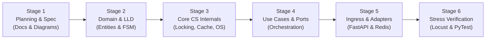

# LedgerCore: Project Vision, Scope & Engineering Lifecycle

> **Project Name:** LedgerCore (Enterprise Edition)  
> **Author & Architect:** Md. Sai Mon Hasan Emon (Backend & Systems Engineer)  
> **Target Alignment:** Pathao (Fintech Engineering), bKash, Optimizely, Samsung SRBD  
> **Status:** Phase 0 (Master Planning & Architecture)  

---

## 1. Executive Vision

**LedgerCore** is a high-throughput, distributed financial transaction processing engine and double-entry ledger system designed from first principles.

In consumer fintech (Pathao Pay, bKash, Stripe), the ledger is the absolute source of truth. Under peak traffic (flash sales, salary days, festival campaigns), the ledger must never corrupt data, never double-charge customers, never freeze under deadlock, and never collapse when downstream partners degrade.

LedgerCore demonstrates that enterprise software engineering is not about stitching frameworks together—it is about **mastering core computer science fundamentals, deterministic concurrency control, and clean object-oriented architecture**.

---

## 2. Target Company Strategic Alignment

| Company & Team | Why This Project Matters to Them | What They Will Scrutinize |
| :--- | :--- | :--- |
| **Pathao (Fintech Engineering)** | Direct 1-to-1 match for their payment infrastructure (Pathao Pay, merchant payouts, ride commissions). | High-concurrency wallet transfers, idempotent mobile retries, asynchronous event dispatching. |
| **bKash (MFS Core Engineering)** | Represents the foundational core of their nationwide mobile financial service. | ACID compliance, double-entry audit invariants, row-level locking, deadlock prevention under bilateral transfers. |
| **Optimizely (Dhaka R&D)** | Proves deep low-level design (LLD) capability, clean abstractions, and sub-millisecond in-memory cache design. | Design pattern adherence (SOLID, GoF), thread-safe custom data structures, unit test coverage. |
| **Samsung SRBD** | Proves systems programming competence in OS concurrency, thread pools, and process lifecycle management. | Multithreading synchronization (mutexes, condition variables), memory footprint, Linux signal handling (`SIGTERM`). |

---

## 3. Project Scope Boundaries

### What We Are Building (In Scope)
* **Double-Entry Ledger:** Mathematical balance verification where every debit has an equal and opposite credit.
* **Deterministic Concurrency Engine:** Canonical row-level locking preventing both race conditions and Coffman circular-wait deadlocks.
* **In-Memory $\mathcal{O}(1)$ LRU Cache with Active TTL:** Custom Doubly Linked List + Hash Map with thread safety.
* **Network Idempotency Protocol:** UUIDv4 check-and-set preventing duplicate charges during client network dropouts.
* **3-State Resilient Circuit Breaker:** Closed $\rightarrow$ Open $\rightarrow$ Half-Open automaton isolating slow external downstream systems.
* **OS-Level Thread Pool:** Worker pool using condition variables with graceful Linux `SIGTERM` draining.
* **Clean Ingress API:** FastAPI application providing REST endpoints, Pydantic v2 schemas, and dependency injection.
* **Deterministic Verification:** Comprehensive unit, stress, and Locust load testing suites verifying 1,000+ QPS.

### What We Are NOT Building (Out of Scope)
* **Frontend UI / Mobile Apps:** This is a pure backend, systems-level engine.
* **Third-Party Real Bank Integrations:** We mock the banking and SMS gateways with realistic network latency and jitter to demonstrate fault tolerance.

---

## 4. End-to-End Engineering Lifecycle

The development lifecycle follows a disciplined 6-stage engineering process:

### Stage 1: Architectural Specification & Blueprint (Current)
* Define domain models, mathematical invariants, class hierarchies, and sequence flows.
* Formalize Big-O time and space complexity guarantees for all custom algorithms.
* Establish testing criteria (100% pass verification, zero balance drift).

### Stage 2: Domain Layer & State Machine
* Implement immutable value objects (`Money`, `AccountId`, `TxId`) with strict decimal precision.
* Build domain entities (`Account`, `Transaction`, `LedgerEntry`) enforcing balance invariants.
* Implement GoF Strategy Pattern for pluggable fee calculations.
* Implement GoF State Pattern for transaction lifecycle transitions.
* **Deliverable:** `tests/test_domain_invariants.py` passing 100%.

### Stage 3: Core CS System Internals
* **DBMS Module:** Canonical Lock Manager implementing deterministic $\min(\text{ID}_A, \text{ID}_B) \rightarrow \max(\text{ID}_A, \text{ID}_B)$ ordering.
* **DSA Module 1:** Custom thread-safe $\mathcal{O}(1)$ LRU Cache with active/lazy TTL expiration.
* **DSA Module 2:** Binary Min-Heap Priority Queue for exponential backoff retries.
* **OS Module:** Worker pool with condition variables and `SIGTERM` task draining.
* **Distributed Systems Module:** Idempotency store and 3-State Circuit Breaker.
* **Deliverable:** Individual module test suites passing 100%.

### Stage 4: Application Layer (Use Cases & Decorators)
* Wire up `ExecuteTransferUseCase` coordinating locking, balance checks, mutations, and ledger inserts.
* Build `AuditReconciliationUseCase` verifying mathematical equilibrium across the system.
* Implement `IdempotencyDecorator` and `CircuitBreakerDecorator` wrapping the execution port.
* **Deliverable:** `tests/test_concurrency_race.py` and `tests/test_deadlock_elimination.py`.

### Stage 5: Ingress Controllers & Infrastructure Adapters
* Build FastAPI HTTP endpoints (`/transfers`, `/accounts`, `/audit`).
* Implement Pydantic v2 schemas and strict exception handlers.
* Containerize via multi-stage `Dockerfile` and `docker-compose.yml` (PostgreSQL + Redis + App).

### Stage 6: Verification, Benchmarking & Defense Packaging
* Run 50-thread concurrent transfer tests (50 threads competing for $100 $\rightarrow$ 1 success, 49 rejected).
* Run 1,000 simultaneous bilateral transfer tests verifying 0 deadlocks.
* Execute Locust benchmark at 1,000+ QPS to generate latency percentiles (P50, P95, P99).
* Complete recruiter presentation README and public portfolio presentation.
