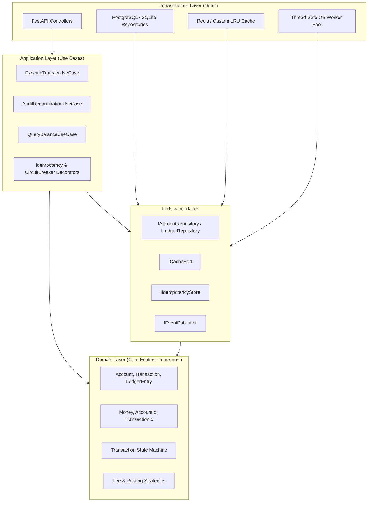
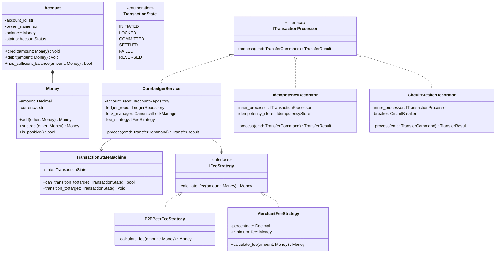

# LedgerCore: Architecture & Low-Level Design (LLD) Patterns

> **Component:** Architectural Blueprint & Object-Oriented Design  
> **Philosophy:** Clean / Hexagonal Architecture (Ports and Adapters) + SOLID Principles  
> **Target Alignment:** bKash, Pathao, Optimizely, Samsung SRBD  

---

## 1. Clean / Hexagonal Architecture Overview

LedgerCore is strictly structured into concentric layers following **Clean Architecture**. The fundamental rule is the **Dependency Rule**: *dependencies must point inward only*.



### Architectural Boundaries:
1. **Domain Layer (`app/domain/`):** Contains pure enterprise business logic and invariants. Has **zero imports** from external libraries (no FastAPI, no SQLAlchemy, no Redis). Can be compiled and tested in total isolation.
2. **Ports Layer (`app/ports/`):** Contains abstract base classes (`typing.Protocol` or `abc.ABC`) defining contracts required by the use cases.
3. **Application Layer (`app/application/`):** Coordinates domain entities, state machines, and ports to execute high-level workflows.
4. **Infrastructure Layer (`app/infrastructure/`):** Implements ports using concrete technologies (SQLAlchemy for PostgreSQL, custom in-memory data structures, threading primitives, network sockets).
5. **Ingress API Layer (`app/api/`):** Translates HTTP JSON requests into application command objects and translates domain exceptions into standard HTTP error responses.

---

## 2. Low-Level Design (LLD) Class Diagram



---

## 3. The 5 GoF Design Patterns: In-Depth Rationale

### 3.1 The Strategy Pattern (Pluggable Commercial Rules)
* **Problem:** Different financial transactions require different fee calculation formulas:
  * Peer-to-Peer (P2P): 0% transaction fee.
  * Merchant Payment: 1.5% fee charged to the merchant.
  * ATM / Agent Cash-out: Tiered flat fee ($15 for $\le 5,000$ BDT; $25 for $> 5,000$ BDT).
* **Anti-Pattern:** Hardcoding a massive `if-elif-else` block inside the transfer service. Adding a new fee policy requires editing core transaction logic, violating the Open/Closed Principle.
* **Our Implementation:**
  ```python
  class IFeeStrategy(ABC):
      @abstractmethod
      def calculate_fee(self, amount: Money) -> Money:
          pass

  class P2PPeerFeeStrategy(IFeeStrategy):
      def calculate_fee(self, amount: Money) -> Money:
          return Money(Decimal("0.00"), amount.currency)

  class MerchantFeeStrategy(IFeeStrategy):
      def __init__(self, rate: Decimal = Decimal("0.015")):
          self.rate = rate

      def calculate_fee(self, amount: Money) -> Money:
          fee_amount = (amount.amount * self.rate).quantize(Decimal("0.01"))
          return Money(fee_amount, amount.currency)
  ```
* **Benefit:** New commercial products (e.g. corporate payroll, bill pay) can be introduced by creating a new strategy class with zero risk to existing transaction pathways.

---

### 3.2 The State Machine Pattern (Deterministic Lifecycle Control)
* **Problem:** Financial transactions must never enter invalid states (e.g., executing a balance transfer on an already `FAILED` transaction, or issuing a refund on an uncommitted transfer).
* **Our Implementation:**
  ```mermaid
  stateDiagram-v2
      [*] --> INITIATED
      INITIATED --> LOCKED : Resource Locks Acquired
      LOCKED --> COMMITTED : Balances Mutated & Ledger Written
      COMMITTED --> SETTLED : External Notification Emitted
      LOCKED --> FAILED : Insufficient Funds / Violation
      INITIATED --> FAILED : Lock Acquisition Timeout
      SETTLED --> REVERSED : Formal Dispute Executed
  ```
* **Benefit:** State transitions are verified by a finite state machine table before any database mutation occurs. Any invalid state jump raises an explicit `IllegalStateTransitionError`.

---

### 3.3 The Decorator Pattern (Cross-Cutting Concerns)
* **Problem:** Cross-cutting concerns like network idempotency caching, circuit breaker tripping, and telemetry timers pollute core business logic if embedded directly inside use cases.
* **Our Implementation:**
  Both `CoreLedgerService`, `IdempotencyDecorator`, and `CircuitBreakerDecorator` implement the same `ITransactionProcessor` interface.
  ```python
  # Runtime Composition:
  core_service = CoreLedgerService(account_repo, ledger_repo, lock_mgr, fee_strategy)
  with_circuit = CircuitBreakerDecorator(core_service, circuit_breaker)
  processor = IdempotencyDecorator(with_circuit, idempotency_store)

  # Client invocation:
  result = processor.process(command)
  ```
* **Execution Flow:**
  1. `IdempotencyDecorator` inspects `Idempotency-Key`. If previously executed, returns cached result immediately.
  2. `CircuitBreakerDecorator` checks downstream service health. If broken, fails fast in $<1\text{ms}$.
  3. `CoreLedgerService` executes deterministic transfer, row locks, and ledger balance mutations.

---

### 3.4 The Observer Pattern (Decoupled Event Publishing)
* **Problem:** Secondary side-effects (dispatching SMS confirmation, logging fraud detection events, updating analytics dashboards) must never slow down or roll back a successfully committed financial transfer.
* **Our Implementation:**
  When `CoreLedgerService` commits a transfer, it fires a `TransactionSettledEvent`.
  ```python
  @dataclass(frozen=True)
  class TransactionSettledEvent:
      transaction_id: str
      from_account_id: str
      to_account_id: str
      amount: Money
      timestamp: float

  class IEventPublisher(Protocol):
      def publish(self, event: TransactionSettledEvent) -> None: ...
  ```
* **Benefit:** Event handlers process tasks asynchronously in background worker threads. If the SMS gateway fails, the financial ledger transaction remains 100% committed and consistent.

---

### 3.5 The Factory Pattern (Clean Adapter Instantiation)
* **Problem:** Hardcoding concrete repository classes inside application code makes local testing slow and makes switching storage backends difficult.
* **Our Implementation:**
  `RepositoryFactory.create_account_repository(env)` returns an ultra-fast in-memory atomic repository for unit and stress testing, or a connection-pooled PostgreSQL adapter for staging and production deployments.

---

## 4. Rigorous SOLID Principles Analysis

| Principle | How LedgerCore Enforces It | Failure Mode Avoided |
| :--- | :--- | :--- |
| **S: Single Responsibility** | `LockManager` only sorts and acquires locks; `LedgerValidator` only checks mathematical balance; `FeeStrategy` only computes fees. | No monolithic 1,000-line service classes where a bug in fee calculation breaks database locks. |
| **O: Open / Closed** | Payment fee rules, notification channels, and caching backends are extensible via interfaces without altering existing classes. | Adding new features never requires modifying existing core ledger code. |
| **L: Liskov Substitution** | `InMemoryAccountRepository` and `PostgresAccountRepository` adhere strictly to `IAccountRepository` behavioral contracts. | Unit tests running against in-memory stores guarantee the exact same semantic behavior as production databases. |
| **I: Interface Segregation** | Read-only consumers (e.g., balance query API) depend only on `IAccountReader`, not on full ledger mutation interfaces. | Read routes cannot accidentally trigger mutation or locking routines. |
| **D: Dependency Inversion** | High-level use cases depend exclusively on abstract ports (`IAccountRepository`, `ICachePort`), never on concrete PostgreSQL or Redis drivers. | Database or caching technology can be upgraded or swapped with zero changes to business domain logic. |
