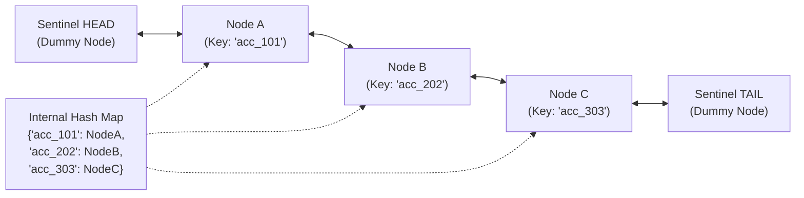
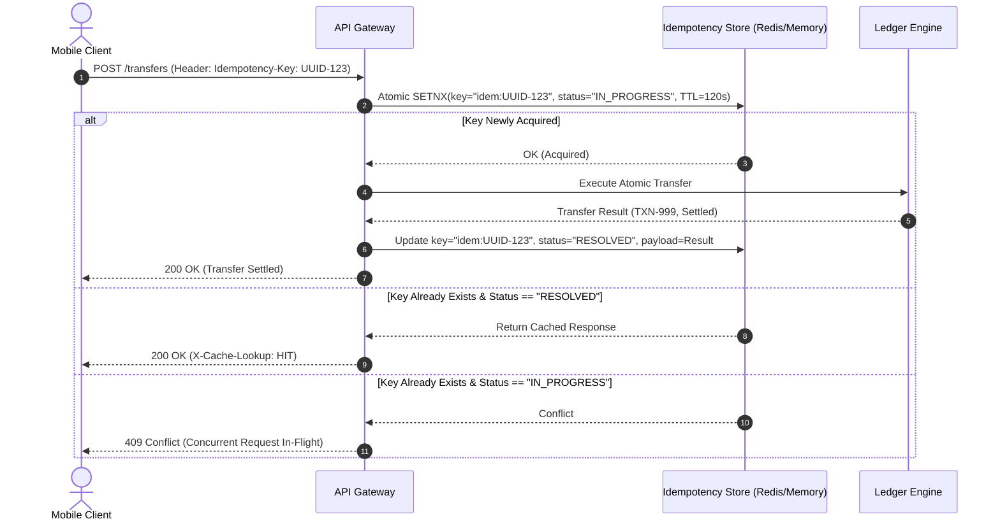

# LedgerCore: Core Computer Science Deep Dive

> **Topics Covered:** Data Structures & Algorithms, Database Internals & Concurrency, Operating Systems & Multithreading, Distributed Networks  
> **Target Alignment:** Tier-1 Product Engineering Technical Interviews (Pathao, bKash, Optimizely, Samsung SRBD)  

---

## 1. Data Structures & Algorithms (DSA)

### 1.1 Custom Thread-Safe $\mathcal{O}(1)$ LRU Cache with Active TTL
* **Location:** `app/infrastructure/dsa/lru_ttl_cache.py`
* **Purpose:** Serves high-frequency account balance queries and token-bucket rate limits without saturating database connection pools.



#### Algorithmic Design:
1. **Doubly Linked List:** Maintains recency order. Most recently accessed nodes are placed immediately after `head`; least recently used nodes reside immediately before `tail`.
2. **Hash Map (`dict[str, Node]`):** Maps keys directly to node memory addresses for $\mathcal{O}(1)$ pointer access.
3. **Dummy Sentinel Nodes:** Using permanent dummy `head` and `tail` nodes eliminates null-pointer edge cases during insertion and deletion.
4. **Dual TTL Expiration Mechanism:**
   * **Lazy Eviction:** Checked during `get(key)`. If `current_time > node.expires_at`, node is purged on-the-fly and returns `None`.
   * **Active Purge:** Background sweep method periodically prunes expired entries to reclaim memory.

#### Complexity Analysis:
* **Time Complexity:**
  * `get(key)`: $\mathcal{O}(1)$ average lookup + $\mathcal{O}(1)$ pointer relocation to head.
  * `put(key, value, ttl)`: $\mathcal{O}(1)$ hash insertion + $\mathcal{O}(1)$ node creation / eviction.
  * `evict_lru()`: $\mathcal{O}(1)$ removal of `tail.prev`.
* **Space Complexity:** $\mathcal{O}(C)$ where $C$ is the maximum capacity threshold.

---

### 1.2 Binary Min-Heap for Scheduled Retries
* **Location:** `app/infrastructure/dsa/priority_retry_heap.py`
* **Purpose:** Manages asynchronous failed webhook deliveries and external notification retries with exponential backoff timestamps.

#### Algorithmic Design:
* Stores tuples: `(scheduled_execution_epoch, retry_attempt, task_payload)`.
* Because the binary heap maintains the heap invariant ($A[\text{parent}] \le A[\text{child}]$), the next task due for execution is always at the root index $0$.

#### Complexity Analysis:
* **Time Complexity:**
  * `push(task)`: $\mathcal{O}(\log N)$ heapify-up.
  * `pop_due_task()`: $\mathcal{O}(1)$ peek to check if `root.epoch <= now()`; $\mathcal{O}(\log N)$ heapify-down on extraction.
* **Space Complexity:** $\mathcal{O}(N)$ where $N$ is the number of pending retry tasks.

---

## 2. Database Internals & Concurrency (DBMS)

### 2.1 Double-Entry Bookkeeping & Audit Invariants
* **The Rule of Conservation of Money:** In financial accounting, currency is never created or destroyed; it only moves across balance sheets.
* Every transfer of amount $M$ generates two simultaneous immutable ledger entries:
  1. Sender Ledger Entry: $\Delta = -M$ (Debit)
  2. Receiver Ledger Entry: $\Delta = +M$ (Credit)

#### The Mathematical Invariants:
1. **Zero-Sum Transaction Invariant:**
   $$\sum \text{Debits} + \sum \text{Credits} = (-M) + (+M) = 0$$
2. **System Audit Equilibrium:**
   $$\sum_{i=1}^{N} \text{CurrentBalance}(\text{Account}_i) = \sum_{j=1}^{K} \text{EntryAmount}(\text{LedgerEntry}_j)$$

---

### 2.2 Concurrency Hazards in Naive Implementations

#### Hazard 1: Lost Update (Race Condition / Double Spending)
Consider two concurrent API threads ($T_1$ and $T_2$) attempting to debit $60 from an account with initial balance $100:

| Time | Thread 1 ($T_1$) | Thread 2 ($T_2$) | Account Balance |
| :---: | :--- | :--- | :---: |
| $t_1$ | Read balance: \$100 | - | \$100 |
| $t_2$ | Check: $100 \ge 60$ (OK) | Read balance: \$100 | \$100 |
| $t_3$ | - | Check: $100 \ge 60$ (OK) | \$100 |
| $t_4$ | Mutate: $100 - 60 = 40$ | - | \$40 |
| $t_5$ | - | Mutate: $100 - 60 = 40$ (Overwrites!) | **\$40 (CRITICAL BUG: \$120 debited from \$100 balance!)** |

#### Hazard 2: Deadlock via Circular Wait (The Coffman Conditions)
Consider User A transferring to User B while User B simultaneously transfers to User A:
* Thread 1: Executes Transfer(A $\rightarrow$ B). Acquires Lock(A). Requests Lock(B).
* Thread 2: Executes Transfer(B $\rightarrow$ A). Acquires Lock(B). Requests Lock(A).
* **Result:** Thread 1 waits for Thread 2; Thread 2 waits for Thread 1. The database connection pool freezes.

---

### 2.3 The Mathematical Solution: Canonical Lock Ordering

Coffman et al. (1971) proved that a deadlock can occur if and only if **all four** conditions hold simultaneously:
1. Mutual Exclusion
2. Hold and Wait
3. No Preemption
4. **Circular Wait**

#### Deadlock Elimination Proof:
By breaking condition 4 (**Circular Wait**), deadlocks become mathematically impossible.

We define a global, strictly monotonic ordering relation $\prec$ over all resource identifiers (e.g. lexicographical sorting of Account IDs):
$$\forall \text{ transfers between } A \text{ and } B, \quad \text{acquire } \min(A, B) \text{ first, then acquire } \max(A, B)$$

```python
# Canonical Resource Ordering Implementation:
def get_lock_order(acc_a: Account, acc_b: Account) -> tuple[Account, Account]:
    if acc_a.account_id < acc_b.account_id:
        return acc_a, acc_b
    return acc_b, acc_a
```

* **Proof:** Suppose a cycle $L_1 \rightarrow L_2 \rightarrow \dots \rightarrow L_k \rightarrow L_1$ exists.
* By our ordering invariant, $L_1 \prec L_2 \prec \dots \prec L_k \prec L_1$.
* By transitivity, $L_1 \prec L_1$, which is a contradiction.
* **Therefore, circular wait deadlocks cannot occur.**

---

## 3. Operating Systems & Multithreading (OS)

### 3.1 Thread Pools with Condition Variables vs. Spin-Locks
* **The Naive Approach (Spin-Lock):** Having worker threads loop constantly (`while not queue.empty(): check()`) burns 100% of CPU cores on idle machines.
* **Our Approach (`threading.Condition`):**
  * When the task queue is empty, worker threads call `condition.wait()`. The operating system transitions the thread into a **Blocked / Sleeping** state, consuming zero CPU cycles.
  * When a new transaction task is enqueued, the producer thread calls `condition.notify()` or `condition.notify_all()`. The Linux kernel wakes up exactly the required number of threads.

### 3.2 Critical Section Protection with Reentrant Locks (`RLock`)
* Why standard `threading.Lock` fails in nested domain methods: If method `transfer()` acquires Lock A, and calls private helper `_verify_balance()` which also attempts to acquire Lock A, a single-threaded self-deadlock occurs.
* We utilize `threading.RLock`: allows the owning thread to acquire the lock multiple times recursively, incrementing an internal counter, and releasing when the counter reaches zero.

### 3.3 Graceful Linux Signal Handling (`SIGINT`, `SIGTERM`)
During rolling deploys or container termination in Docker/Kubernetes:
1. Kernel sends `SIGTERM` (signal 15) to process PID 1.
2. Signal handler sets `shutdown_event.set()`.
3. Ingress layer stops accepting new requests (responds with `503 Service Unavailable`).
4. Worker threads are notified to drain all pending items currently inside bounded queues.
5. Database connection pools and file handles are flushed and closed.
6. Process exits cleanly with code 0. **Zero partial writes, zero corrupt ledger entries.**

---

## 4. Computer Networks & Distributed Systems

### 4.1 Idempotency Key Protocol (At-Most-Once Delivery)



### 4.2 3-State Resilient Circuit Breaker
* **Closed State:** Requests pass normally. Success and failure counters are recorded in a sliding time window (10 seconds).
* **Open State (Tripped):** If failure rate exceeds 50% (minimum 5 requests), circuit trips to `OPEN`. All incoming requests fail immediately in $<1\text{ms}$ with `CircuitBreakerOpenException`.
* **Half-Open State (Canary Probe):** After a recovery timeout (30 seconds), the circuit allows 3 canary trial requests through. If all 3 succeed, circuit resets to `CLOSED`. If any canary fails, it trips back to `OPEN`.

### 4.3 Exponential Backoff with Full Jitter
To prevent retry synchronization (Thundering Herd) when a downed downstream service recovers, we calculate retry delay $T$ using:
$$T = \text{UniformRandom}\left(0, \, \min\left(T_{\max}, \, T_{\text{base}} \times 2^{\text{attempt}}\right)\right)$$
* Where $T_{\text{base}} = 0.5\text{s}$, $T_{\max} = 30\text{s}$.
* Full jitter decorrelates retry storms, distributing server load uniformly across time.
