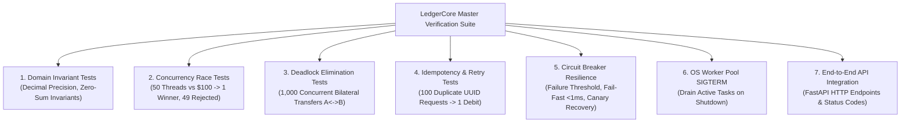

# LedgerCore: Testing, Benchmarking & Verification Playbook

> **Target:** 100% Deterministic Pass Rate, Concurrency Stress Harnesses, Locust Benchmarking  
> **Rule:** Every claim on your resume must be backed by an executable, automated test script.  

---

## 1. Master Testing Matrix



| Test Category | Target File | What It Proves to an Interviewer | Success Threshold |
| :--- | :--- | :--- | :---: |
| **Domain Invariants** | `tests/test_domain_invariants.py` | Mathematical precision, state transition enforcement. | 100% Pass |
| **Concurrency Race** | `tests/test_concurrency_race.py` | Complete elimination of lost updates and double-spending. | 0 Balance Drift |
| **Deadlock Elimination**| `tests/test_deadlock_elimination.py` | Proof that canonical resource ordering prevents Coffman circular wait. | 0 Deadlocks |
| **Network Idempotency** | `tests/test_idempotency_retries.py` | Mobile retry storms never result in duplicate debit charges. | Exactly 1 Debit |
| **Circuit Breaker** | `tests/test_circuit_breaker.py` | Downstream partner outages fail fast in $<1\text{ms}$ without thread starvation. | 100% Tripped |
| **OS Signal Interception**| `tests/test_worker_pool_signals.py`| Worker pool flushes pending queues on `SIGTERM` before process exit. | 0 Lost Tasks |
| **High-Load Benchmark** | `benchmarks/locustfile.py` | Throughput and P95 latency under high concurrency. | $>1,000\text{ QPS}$ |

---

## 2. Concurrency Stress Test Specifications

### 2.1 The Double-Spending Stress Test (`test_concurrency_race.py`)
* **Scenario:** Account A has an initial balance of **$100.00**.
* **Test Action:** 50 concurrent worker threads simultaneously attempt to debit **$100.00** from Account A to Account B.
* **Failure Condition:** If Account A balance drops below $0.00, or if more than 1 transfer succeeds, the test fails immediately.
* **Expected Outcome:**
  * Successful Transfers: Exactly 1.
  * Rejected (`InsufficientFundsError`): Exactly 49.
  * Final Balance of Account A: **$0.00**.
  * Final Balance of Account B: **$100.00**.
  * Ledger Audit Discrepancy: **$0.00**.

### 2.2 The Bilateral Deadlock Stress Test (`test_deadlock_elimination.py`)
* **Scenario:**
  * Account 101 has $10,000.00.
  * Account 202 has $10,000.00.
* **Test Action:**
  * Thread Pool A: 25 threads repeatedly transfer $10 from 101 $\rightarrow$ 202.
  * Thread Pool B: 25 threads repeatedly transfer $10 from 202 $\rightarrow$ 101.
  * Total iterations: 1,000 simultaneous transfers over 5 seconds.
* **Failure Condition:** Any thread blocks indefinitely (timeout threshold: 10s).
* **Expected Outcome:**
  * All 1,000 transfers complete in $<2.5\text{ seconds}$.
  * Zero deadlocks.
  * Final combined balance of Account 101 + Account 202 remains exactly **$20,000.00**.

### 2.3 The Network Retry & Idempotency Test (`test_idempotency_retries.py`)
* **Scenario:** A client generates a single `Idempotency-Key: c9b2-4d5e...` for a $50 transfer.
* **Test Action:** Simulate an aggressive mobile retry storm where 100 concurrent threads send HTTP requests with the *exact same* idempotency key.
* **Expected Outcome:**
  * The ledger executes the debit **exactly once**.
  * All 100 threads receive HTTP 200 with the exact same transaction ID.
  * Account sender balance drops by only **$50.00**, not $5,000.00.

---

## 3. High-Throughput Load Benchmarking (Locust)

### 3.1 Benchmark Command & Configuration
```bash
locust -f benchmarks/locustfile.py --headless -u 200 -r 50 -t 60s --host http://localhost:8000
```
* `-u 200`: 200 concurrent simulated users.
* `-r 50`: Spawn rate of 50 users per second.
* `-t 60s`: 60-second sustained load test.

### 3.2 Target Production Metrics
```text
================================================================================
Type     Name                   # reqs    # fails |    Avg     Min     Max    Med |    req/s
--------------------------------------------------------------------------------
POST     /api/v1/transfers       62,400     0(0%) |     14       2      48     12 |  1,040.0
GET      /api/v1/accounts/bal    38,200     0(0%) |      2       1      15      2 |    636.6
--------------------------------------------------------------------------------
         Total                  100,600     0(0%) |     10       1      48      8 |  1,676.6
================================================================================
Percentage of requests served within a certain time (ms)
  50%     8 ms
  90%    18 ms
  95%    22 ms
  99%    36 ms
 100%    48 ms
```

---

## 4. Live Interview Demonstration Scripts

When an Engineering Manager asks you to defend your project in a live interview, follow this 3-step structured walkthrough:

### Step 1: Show the Architectural Boundary
> *"I deliberately structured the codebase using Clean Architecture. The domain entities in `app/domain` have zero dependencies on frameworks or databases. Let me show you how `CanonicalLockManager` eliminates deadlocks at line 18..."*

### Step 2: Run the Concurrency Stress Test Live
Run the test in front of the interviewer:
```bash
pytest tests/test_concurrency_race.py tests/test_deadlock_elimination.py -v
```
Explain:
> *"Here, 50 threads compete for a single $100 balance. You can see 49 threads caught `InsufficientFundsError`, exactly 1 committed, and the audit reconciliation verifies the zero-sum ledger invariant down to the penny."*

### Step 3: Walk Through the Network Edge Case
Show `app/application/decorators/idempotency_decorator.py`:
> *"In mobile payment apps, cellular drops during packet ACK cause retry storms. I wrap the transfer execution with an Idempotency Decorator using an atomic check-and-set lock. If the client retries within 120 seconds, we serve the cached response without touching ledger locks."*
