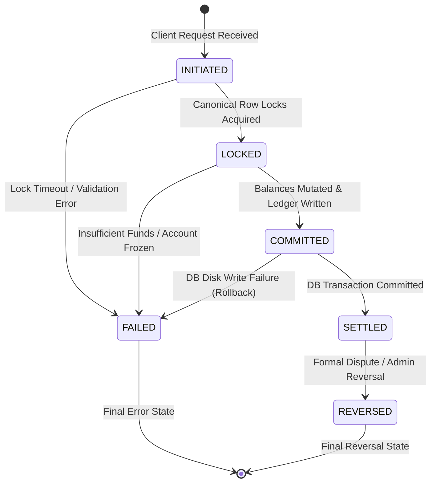
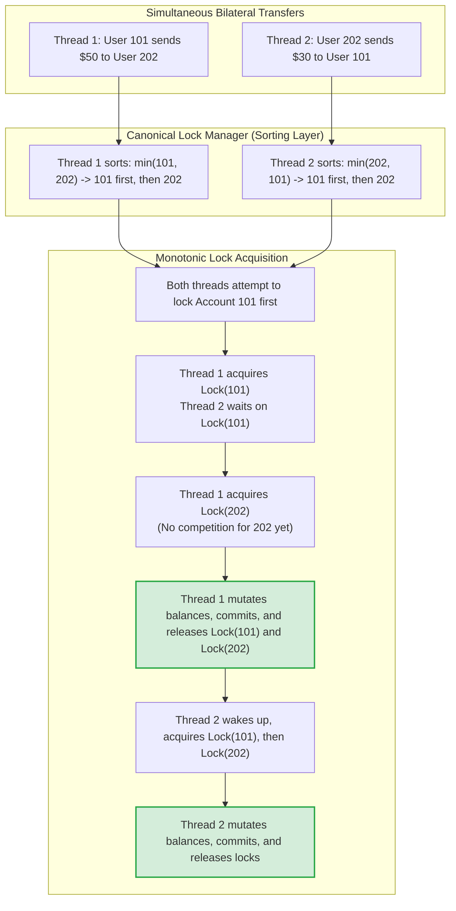
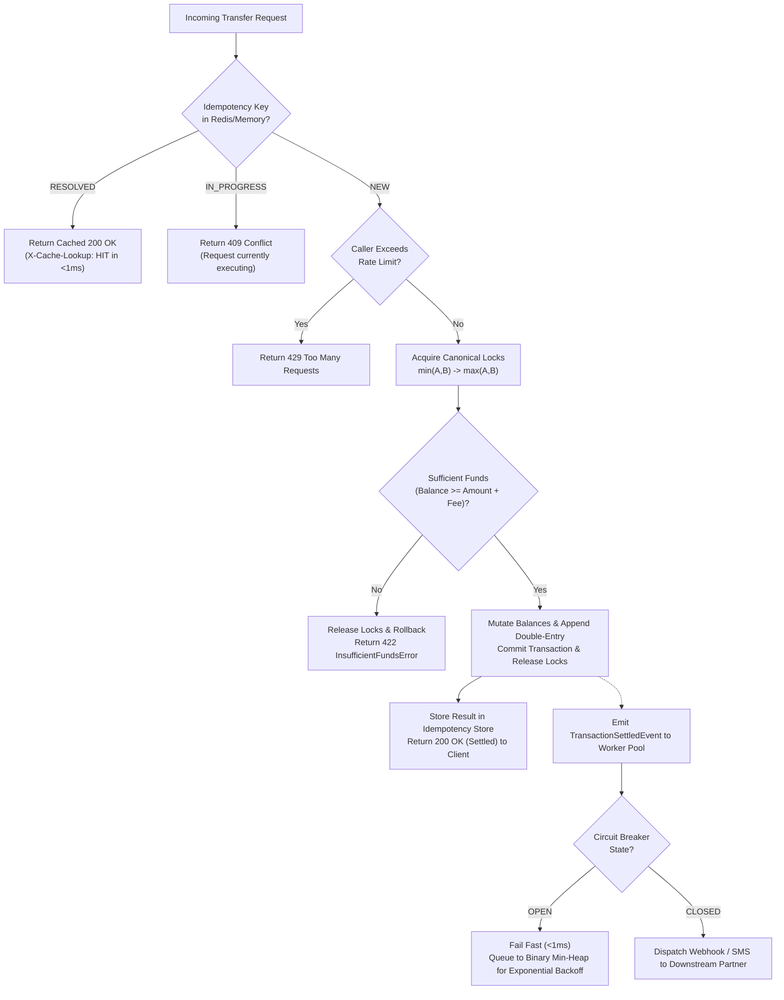

# LedgerCore: End-to-End System Flow & Architecture Diagrams

> **Component:** End-to-End Execution Flow, Sequence Diagrams & State Transitions  
> **Target Alignment:** Pathao (Fintech Engineering), bKash, Optimizely, Samsung SRBD  
> **Status:** Production Flow Specification  

---

## 1. Master End-to-End Sequence Diagram

This diagram traces an incoming payment request from initial HTTP ingress through all middleware, domain logic, concurrency locks, database commit, and asynchronous event notifications.

```mermaid
sequenceDiagram
    autonumber
    actor Client as Mobile Client / Merchant
    participant Ingress as FastAPI Gateway (/transfers)
    participant Idem as Idempotency Decorator (Redis/Memory)
    participant Rate as Token Bucket Rate Limiter (O(1) Cache)
    participant Strat as Fee Strategy Router (GoF Strategy)
    participant LockMgr as Canonical Lock Manager
    participant DB as PostgreSQL (ACID Storage)
    participant FSM as Transaction State Machine (GoF State)
    participant Pool as OS Worker Pool (Condition Variables)
    participant CB as 3-State Circuit Breaker
    participant Webhook as Downstream Partner (SMS/Bank)

    %% Step 1: Ingress
    Note over Client,Ingress: Client submits transfer with unique UUID
    Client->>Ingress: POST /api/v1/transfers<br/>Headers: Idempotency-Key: UUID-777<br/>Body: {from: 101, to: 202, amount: 500, type: MERCHANT}
    
    %% Step 2: Idempotency Layer
    Ingress->>Idem: Check key "idem:UUID-777" (SETNX with 120s TTL)
    alt Key Already Resolved (Mobile Network Retry Scenario)
        Idem-->>Client: 200 OK (Cached Response, X-Cache-Lookup: HIT)
    else Key Currently In-Progress
        Idem-->>Client: 409 Conflict (Concurrent Duplicate Request)
    else Key Newly Acquired (Proceed)
        %% Step 3: Rate Limiting
        Idem->>Rate: Consume Token for caller IP / Account
        alt Quota Exceeded
            Rate-->>Client: 429 Too Many Requests
        else Quota OK
            Rate-->>Idem: Proceed
            
            %% Step 4: Fee Strategy Calculation
            Idem->>Strat: calculate_fee(amount=500.00, type="MERCHANT")
            Strat-->>Idem: Fee = 7.50 BDT (Total Debit = 507.50 BDT)
            
            %% Step 5: Canonical Lock Ordering
            Idem->>LockMgr: acquire_pair(Account 101, Account 202)
            Note over LockMgr: Deadlock Elimination Algorithm:<br/>First Lock: min(101, 202) = 101<br/>Second Lock: max(101, 202) = 202
            LockMgr->>DB: BEGIN TRANSACTION;<br/>SELECT * FROM accounts WHERE id IN (101, 202) FOR UPDATE;
            DB-->>LockMgr: Rows Locked Exclusively
            
            %% Step 6: State Machine & Balance Verification
            LockMgr->>FSM: transition_to(TransactionState.LOCKED)
            alt Sender Balance < Required (507.50 BDT)
                LockMgr->>FSM: transition_to(TransactionState.FAILED)
                LockMgr->>DB: ROLLBACK;
                LockMgr-->>Client: 422 Unprocessable Entity (InsufficientFundsError)
            else Sender Balance >= Required
                %% Step 7: Atomic Mutation & Double-Entry Bookkeeping
                Note over LockMgr,DB: Mutate Balances:<br/>Acc 101: 10,000 - 507.50 = 9,492.50<br/>Acc 202: 5,000 + 500.00 = 5,500.00<br/>Platform Revenue: +7.50
                Note over LockMgr,DB: Double-Entry Equilibrium:<br/>Debit (-507.50) + Credit (+500.00) + Fee (+7.50) == 0.00
                LockMgr->>DB: INSERT INTO ledger_entries (Debit Entry);<br/>INSERT INTO ledger_entries (Credit Entry);<br/>INSERT INTO ledger_entries (Fee Entry);
                LockMgr->>DB: COMMIT TRANSACTION; (WAL Flushed to Disk)
                LockMgr->>FSM: transition_to(TransactionState.COMMITTED)<br/>transition_to(TransactionState.SETTLED)
                
                %% Step 8: Resolve Idempotency & Return Client Response
                LockMgr->>Idem: store_result("idem:UUID-777", payload=Result, TTL=86400s)
                Idem-->>Client: 200 OK (Transfer Settled, TXN-8921, P95 <= 15ms)
                
                %% Step 9: Decoupled Asynchronous Events
                LockMgr->>Pool: enqueue(TransactionSettledEvent)
                Note over Pool: Worker thread wakes via condition.notify()<br/>Executes non-blocking in background
                Pool->>CB: execute_guarded_call(send_sms_notification)
                alt Circuit CLOSED (Downstream Partner Healthy)
                    CB->>Webhook: HTTP POST /sms/notify
                    Webhook-->>CB: 200 OK
                else Circuit OPEN (Downstream Partner Outage)
                    CB-->>Pool: Fail Fast in <1ms (No thread starvation)
                    Note over Pool: Task queued to Binary Min-Heap<br/>for Exponential Backoff Retry
                end
            end
        end
    end
```

---

## 2. Transaction Lifecycle State Machine Diagram

Every financial transaction is governed by a finite state machine (`TransactionStateMachine`) enforcing valid transition boundaries:



### Transition Invariants:
1. An uncommitted transaction can **never** jump to `SETTLED`.
2. A `FAILED` transaction can **never** be mutated or reversed.
3. A `REVERSED` transaction creates a balanced compensating double-entry pair without deleting historical records.

---

## 3. Concurrency & Deadlock Elimination Flowchart

Demonstrating how the **Canonical Lock Ordering** algorithm prevents Coffman circular-wait deadlocks during simultaneous bilateral transfers:



---

## 4. Error Handling & Resilience Flowchart

How LedgerCore handles unexpected edge cases gracefully without losing data or hanging client threads:



---

## 5. Latency Waterfall Analysis (Sub-15ms Guarantee)

| Milestone | Subsystem | Typical Execution Time |
| :--- | :--- | :---: |
| 1. HTTP Ingress & JSON Schema Validation | FastAPI + Pydantic v2 | $0.8\text{ ms}$ |
| 2. Idempotency Key Atomic Check (`SETNX`) | Redis / In-Memory Store | $0.4\text{ ms}$ |
| 3. Rate Limit Token Bucket Check | Custom $\mathcal{O}(1)$ LRU Cache | $0.1\text{ ms}$ |
| 4. Commercial Fee Strategy Calculation | Domain Strategy Object | $0.05\text{ ms}$ |
| 5. Canonical Row Lock Acquisition | PostgreSQL / RLock Mutex | $2.5\text{ ms}$ |
| 6. Balance Verification & State Transition | Domain Entity Logic | $0.1\text{ ms}$ |
| 7. Double-Entry Insert & Transaction Commit | PostgreSQL WAL Disk Flush | $8.0\text{ ms}$ |
| 8. Idempotency Cache Result Resolution | Redis / In-Memory Store | $0.5\text{ ms}$ |
| 9. HTTP JSON Serialization & Response Egress | FastAPI + Uvicorn | $0.6\text{ ms}$ |
| **Total Round-Trip Latency (P95)** | **End-to-End System** | **$\approx 13.05\text{ ms}$** |
| *Decoupled Background Tasks (Async)* | *OS Worker Pool (Non-Blocking)* | *Executed after client response* |
