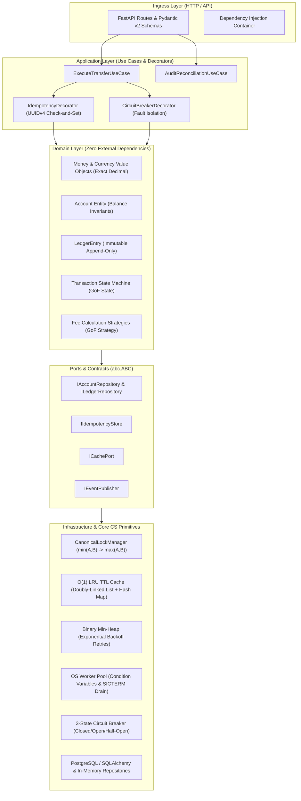
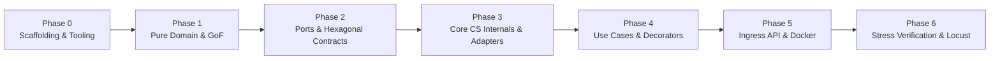

# LedgerCore: Implementation Phases & Engineering Roadmap

> **Author & Architect:** Md. Sai Mon Hasan Emon (Backend & Systems Engineer)  
> **Target Alignment:** Pathao (Fintech Engineering), bKash, Optimizely, Samsung SRBD  
> **Tech Stack:** Python 3.12+, FastAPI, PostgreSQL, Redis, Docker, PyTest, Locust  
> **Architecture:** Clean / Hexagonal Architecture (Ports & Adapters)  
> **Status:** Production Implementation Roadmap (Phase 0 through Phase 6)

---

## 1. Executive Summary & Architecture Blueprint

**LedgerCore** is a high-throughput, distributed financial transaction processing engine and double-entry ledger system built from first principles. It enforces strict mathematical balance integrity ($\sum \text{Debits} + \sum \text{Credits} = 0$), deterministic deadlock-free concurrency, at-most-once delivery, and sub-millisecond fault isolation.

### High-Level Hexagonal Layering



---

## 2. Master Implementation Phases



---

### Phase 0: Workspace Setup and Clean Architecture Scaffolding

#### Objective
Initialize the Python 3.12+ project environment, dependency management, strict static analysis, and establish the clean architectural boundaries before writing business logic.

#### Directory Structure Scaffolding
```text
ledger_core/
├── app/
│   ├── __init__.py
│   ├── domain/                  # Pure financial domain logic (0 framework imports)
│   ├── ports/                   # Abstract contracts (abc.ABC interfaces)
│   ├── application/             # Use cases, orchestration, and decorators
│   ├── infrastructure/          # Data structures, concurrency, persistence, workers
│   └── api/                     # FastAPI ingress, schemas, routes, and DI
├── tests/                       # Pytest verification suites
├── benchmarks/                  # Locust load test scripts
├── docs/                        # Architectural documentation and diagrams
├── pyproject.toml               # Poetry/pip tooling configuration
├── requirements.txt             # Pinned production and test dependencies
├── Dockerfile                   # Multi-stage containerization
└── docker-compose.yml           # Local dev orchestrator (App, Postgres, Redis)
```

#### Core Deliverables & Steps
1. **Tooling & Dependencies Configuration:**
   * Create `pyproject.toml` and `requirements.txt` with dependencies: `fastapi`, `uvicorn[standard]`, `pydantic>=2.0`, `sqlalchemy[asyncio]>=2.0`, `asyncpg`, `redis>=5.0`, `pytest`, `pytest-asyncio`, `pytest-cov`, `mypy`, `ruff`, `locust`.
2. **Architecture Boundary Enforcement:**
   * Configure `mypy` strict mode (`disallow_untyped_defs = true`, `no_implicit_optional = true`).
   * Configure import boundaries so `app/domain/` never imports from `app/infrastructure/` or `app/api/`.
3. **Empty Test Harness Discovery:**
   * Configure `pytest.ini` / `pyproject.toml` to recognize `tests/` directory with `asyncio_mode = "auto"`.

#### Verification & Exit Criteria
* Run `pytest`: discovers the test runner cleanly with 0 configuration errors.
* Run `mypy app/ tests/`: passes with 0 type violations.

---

### Phase 1: Pure Domain Layer & GoF Design Patterns

#### Objective
Implement the core financial building blocks and domain business rules with **zero external dependencies** (standard library only: `decimal`, `dataclasses`, `enum`, `typing`).

#### Target Files & Deliverables
* `app/domain/value_objects.py`: Immutable value objects.
* `app/domain/models.py`: Domain entities enforcing balance and ledger invariants.
* `app/domain/state_machine.py`: Transaction finite-state machine (GoF State Pattern).
* `app/domain/strategies/fee_strategy.py`: Pluggable fee calculation (GoF Strategy Pattern).
* `tests/test_domain_invariants.py`: Unit test suite verifying domain safety.

#### Core CS & LLD Mechanisms
1. **`Money` Value Object:**
   * Immutable (`@dataclass(frozen=True)`).
   * Exact `Decimal` arithmetic with 2-decimal scale validation (`amount.as_tuple().exponent >= -2`).
   * Currency isolation (rejects cross-currency operations such as `BDT + USD`).
   * Eliminates binary floating-point representation errors (`0.1 + 0.2 != 0.3`).
2. **`Account` Entity:**
   * Fields: `account_id: str`, `owner_name: str`, `balance: Money`, `status: AccountStatus`.
   * Methods: `debit(money)`, `credit(money)`, `has_sufficient_balance(money)`.
   * Enforces non-negative balance invariant (`InsufficientFundsError`).
3. **`LedgerEntry` (Double-Entry Bookkeeping):**
   * Immutable, append-only record tracking `entry_id`, `transaction_id`, `account_id`, `entry_type` (`DEBIT` | `CREDIT`), `amount`, and `created_at`.
   * Zero-sum conservation: every debit must pair with an equal and opposite credit.
4. **GoF State Pattern (`TransactionStateMachine`):**
   * States: `INITIATED` $\rightarrow$ `LOCKED` $\rightarrow$ `COMMITTED` $\rightarrow$ `SETTLED`.
   * Error paths: `INITIATED` $\rightarrow$ `FAILED`, `LOCKED` $\rightarrow$ `FAILED`.
   * Reversals: `SETTLED` $\rightarrow$ `REVERSED` (generates compensating ledger entries; never deletes audit history).
   * Invariant: `FAILED` transactions cannot be settled; uncommitted transactions cannot transition to `SETTLED`.
5. **GoF Strategy Pattern (`IFeeStrategy`):**
   * `P2PFeeStrategy`: Flat platform fee or percentage with fee caps.
   * `MerchantFeeStrategy`: Tiered commercial transaction fee (e.g., 1.5%).

#### Verification & Exit Criteria
* `tests/test_domain_invariants.py`:
  * Validates exact decimal calculations down to fractional cents.
  * Validates immediate rejection of overdraft attempts (`InsufficientFundsError`).
  * Validates illegal state transitions raise `InvalidStateTransitionError`.

---

### Phase 2: Ports & Architectural Contracts (Hexagonal Boundaries)

#### Objective
Define abstract interface contracts using `abc.ABC` to achieve true Dependency Inversion (DIP), isolating domain and use case logic from storage engines, caching layers, and external network APIs.

#### Target Files & Deliverables
* `app/ports/repository_ports.py`: Persistence contracts.
* `app/ports/idempotency_port.py`: Idempotency storage contract.
* `app/ports/cache_port.py`: Key-value cache contract.
* `app/ports/event_publisher_port.py`: Asynchronous event broker contract.

#### Port Specifications
1. **`IAccountRepository` & `ILedgerRepository`:**
   ```python
   class IAccountRepository(ABC):
       @abstractmethod
       async def get_by_id(self, account_id: str) -> Optional[Account]: ...
       @abstractmethod
       async def update_balance(self, account_id: str, new_balance: Money) -> None: ...
       @abstractmethod
       async def create(self, account: Account) -> Account: ...

   class ILedgerRepository(ABC):
       @abstractmethod
       async def append_entries(self, entries: list[LedgerEntry]) -> None: ...
       @abstractmethod
       async def get_entries_by_account(self, account_id: str) -> list[LedgerEntry]: ...
       @abstractmethod
       async def get_total_system_net(self) -> Decimal: ...
   ```
2. **`IIdempotencyStore`:**
   * Methods: `try_acquire(key: str, ttl_seconds: int) -> bool`, `get_result(key: str) -> Optional[Any]`, `store_result(key: str, result: Any, ttl_seconds: int) -> None`.
3. **`ICachePort`:**
   * Contract for sub-millisecond $\mathcal{O}(1)$ data lookups.
4. **`IEventPublisher`:**
   * Methods: `publish(event_type: str, payload: dict) -> None`.

#### Verification & Exit Criteria
* `mypy --strict app/ports/` compiles without errors.
* Unit test mocks can cleanly implement all ports without framework coupling.

---

### Phase 3: Core CS System Internals & Infrastructure Primitives

#### Objective
Implement low-level computer science algorithms, thread-safe synchronization primitives, deadlock-free concurrency managers, and infrastructure adapters.

#### Target Files & Deliverables
* `app/infrastructure/concurrency/lock_manager.py`: Deadlock-free canonical locking.
* `app/infrastructure/dsa/lru_ttl_cache.py`: Custom $\mathcal{O}(1)$ LRU Cache with active/lazy TTL.
* `app/infrastructure/dsa/priority_retry_heap.py`: Binary min-heap for retry scheduling.
* `app/infrastructure/os_threading/worker_pool.py`: Condition variable thread pool with signal draining.
* `app/infrastructure/resilience/circuit_breaker.py`: 3-state circuit breaker automaton.
* `app/infrastructure/persistence/memory_repositories.py`: Thread-safe in-memory repositories.
* `app/infrastructure/persistence/sql_repositories.py`: PostgreSQL ACID repositories (`SELECT ... FOR UPDATE`).

#### Core CS & Systems Mechanisms
1. **Canonical Lock Manager (Deadlock Elimination):**
   * **Problem:** Simultaneous bilateral transfers (Thread 1: $A \rightarrow B$; Thread 2: $B \rightarrow A$) induce Coffman circular wait and crash under DBMS deadlock.
   * **Solution:** Global Deterministic Lock Ordering:
     $$\text{Lock Order} = (\min(\text{ID}_A, \text{ID}_B), \max(\text{ID}_A, \text{ID}_B))$$
   * Provably eliminates the circular-wait condition for any pair of accounts.
2. **Custom $\mathcal{O}(1)$ LRU TTL Cache:**
   * Internal Structure: Doubly-Linked List (`Node(key, value, expiry, prev, next)`) + Hash Map (`dict[key, Node]`) with dummy `head` and `tail` sentinels.
   * Eviction Policy: Least Recently Used evicted when `capacity` is reached.
   * Expiration: Lazy eviction on access + background active sweep.
   * Concurrency: Thread safety enforced via `threading.RLock`.
3. **Binary Min-Heap Priority Queue:**
   * Stores retry items indexed by `next_retry_timestamp`.
   * Guarantees $\mathcal{O}(\log N)$ insertion and $\mathcal{O}(1)$ peek for earliest retry candidate.
   * Manages exponential backoff retries for failed downstream notifications.
4. **Bounded OS Worker Pool (`ThreadSafeWorkerPool`):**
   * Synchronized using `threading.Condition` variables; worker threads sleep when the queue is empty, eliminating CPU spin-locking.
   * Graceful Shutdown: Hooks into Linux `SIGINT` / `SIGTERM` signals, closes the queue to new tasks, drains in-flight items, and terminates cleanly.
5. **3-State Resilient Circuit Breaker:**
   * States: `CLOSED` (normal operation) $\rightarrow$ `OPEN` (fail fast in $<1\text{ms}$) $\rightarrow$ `HALF-OPEN` (trial recovery probe).
   * Sliding failure counter with time window and cool-down resets.

#### Verification & Exit Criteria
* `tests/test_dsa_lru_cache.py`: Validates $\mathcal{O}(1)$ hit/miss, LRU eviction order, and TTL expiration.
* `tests/test_priority_retry_heap.py`: Validates min-heap extraction order under random timestamps.
* `tests/test_circuit_breaker.py`: Validates state transitions upon threshold breaches.

---

### Phase 4: Application Layer (Use Cases & Resilience Decorators)

#### Objective
Orchestrate domain operations, enforce transaction atomicity, coordinate persistence ports, and wrap use cases with resilience decorators.

#### Target Files & Deliverables
* `app/application/use_cases/execute_transfer.py`: Core money transfer use case.
* `app/application/use_cases/audit_reconciliation.py`: Balance integrity verification use case.
* `app/application/use_cases/query_balance.py`: Fast balance retrieval use case.
* `app/application/decorators/idempotency_decorator.py`: At-most-once network execution wrapper.
* `app/application/decorators/circuit_decorator.py`: Downstream fault-isolation wrapper.

#### Use Case Execution Sequence (`ExecuteTransferUseCase`)
```text
1. Receive TransferCommand(idempotency_key, from_id, to_id, amount, fee_strategy)
2. Verify accounts exist via IAccountRepository
3. Compute transaction fee using selected IFeeStrategy
4. Acquire canonical row locks: min(from_id, to_id) -> max(from_id, to_id)
5. Initialize TransactionStateMachine: INITIATED -> LOCKED
6. Verify sender balance >= (amount + fee)
7. Mutate in-memory balances:
     Sender: debit(amount + fee)
     Receiver: credit(amount)
     (Optional Platform Account: credit(fee))
8. Generate and append balanced double-entry LedgerEntry records
9. Update account balances atomically in repository
10. Transition state machine: LOCKED -> COMMITTED -> SETTLED
11. Release canonical locks
12. Publish TransactionSettledEvent via Worker Pool (asynchronous)
13. Return TransferResult
```

#### Invariant Auditor (`AuditReconciliationUseCase`)
* Queries all account balances and all ledger debit/credit entries:
  $$\text{Invariant} = \sum_{\text{all accounts}} \text{Balance} - \sum_{\text{all ledger entries}} \text{Net} \equiv \text{Decimal('0.00')}$$
* Immediately flags non-zero audit drift as financial corruption.

#### Verification & Exit Criteria
* `tests/test_transfer_use_case.py`: Validates balanced double-entry transfers under normal and edge conditions.
* `tests/test_audit_reconciliation.py`: Confirms invariant balance calculation returns zero drift.

---

### Phase 5: Ingress API Layer & Containerization

#### Objective
Expose high-performance RESTful HTTP endpoints via FastAPI, implement Pydantic v2 validation, configure dependency injection, and deliver multi-stage Docker containerization.

#### Target Files & Deliverables
* `app/api/schemas.py`: Pydantic v2 request/response models.
* `app/api/routes/transfers.py`: `POST /api/v1/transfers`.
* `app/api/routes/accounts.py`: `POST /api/v1/accounts`, `GET /api/v1/accounts/{id}/balance`.
* `app/api/routes/audit.py`: `GET /api/v1/audit/reconciliation`.
* `app/api/dependencies.py`: Dependency Injection container wiring infrastructure adapters to use cases.
* `app/api/main.py`: FastAPI app initialization, CORS, exception handlers, and lifespan handlers.
* `Dockerfile` & `docker-compose.yml`: Production container deployment.

#### API Endpoints Specification
| Method | Route | Headers / Parameters | Expected Response | Description |
| :--- | :--- | :--- | :--- | :--- |
| `POST` | `/api/v1/accounts` | Body: `{account_id, owner_name, initial_balance, currency}` | `201 Created` | Creates and seeds an account. |
| `POST` | `/api/v1/transfers` | Header: `Idempotency-Key: <UUIDv4>`<br>Body: `{from_account_id, to_account_id, amount, currency, transfer_type}` | `200 OK` (or cached `200 OK`) | Executes atomic double-entry transfer. |
| `GET` | `/api/v1/accounts/{id}/balance` | Path: `id` | `200 OK` `{account_id, balance, currency}` | Queries account balance. |
| `GET` | `/api/v1/audit/reconciliation` | None | `200 OK` `{is_balanced, drift, total_balance}` | Computes system balance checksum. |

#### Verification & Exit Criteria
* `tests/test_api_integration.py`: End-to-end HTTP integration tests pass with 200/201/400/409/422 status codes verified.
* `docker-compose up`: Successfully launches FastAPI, PostgreSQL 16, and Redis 7 in healthy states.

---

### Phase 6: Concurrency Stress Verification & Benchmarking

#### Objective
Subject LedgerCore to deliberate high-load contention, race conditions, and network faults to empirically validate all engineering guarantees.

#### The 5 Rigorous Verification Test Suites
1. **Double-Spending Stress Test (`tests/test_concurrency_race.py`):**
   * **Setup:** Account $A$ holds exactly $\$100.00$.
   * **Action:** 50 concurrent worker threads simultaneously attempt to debit $\$100.00$.
   * **Success Criteria:**
     * Exactly 1 transfer succeeds ($200\text{ OK}$).
     * Exactly 49 transfers are rejected with `InsufficientFundsError` ($400\text{ Bad Request}$).
     * Final balance of Account $A$ is exactly $\$0.00$.
     * System reconciliation audit drift is $\text{Decimal('0.00')}$.
2. **Bilateral Deadlock Elimination Test (`tests/test_deadlock_elimination.py`):**
   * **Setup:** Account 101 holds $\$10,000.00$; Account 202 holds $\$10,000.00$. Total = $\$20,000.00$.
   * **Action:** 1,000 simultaneous transfers (500 transfers $101 \rightarrow 202$, 500 transfers $202 \rightarrow 101$) executed concurrently across 50 threads.
   * **Success Criteria:**
     * 0 deadlocks encountered.
     * 0 thread lock acquisition timeouts.
     * Total combined balance remains strictly conserved at $\$20,000.00$.
3. **Network Idempotency Retries (`tests/test_idempotency_retries.py`):**
   * **Setup:** 100 concurrent threads fire the identical transfer payload using the same `Idempotency-Key` UUIDv4.
   * **Success Criteria:**
     * Exactly 1 balance debit executed against the database.
     * 99 threads receive identical cached responses from the idempotency store.
4. **OS Signal Interception Test (`tests/test_worker_pool_signals.py`):**
   * **Setup:** Enqueue 100 background notification tasks into the `ThreadSafeWorkerPool`.
   * **Action:** Issue synthetic `SIGTERM` / `SIGINT` signals to the process.
   * **Success Criteria:**
     * Pool rejects new work immediately.
     * In-flight tasks drain to completion without task loss or database corruption.
5. **High-Throughput Locust Benchmark (`benchmarks/locustfile.py`):**
   * **Load Profile:** 200 concurrent simulated users generating transfer traffic over 60 seconds.
   * **Success Criteria:**
     * Throughput: $> 1,000\text{ QPS}$.
     * Latency: $P_{95} \le 22\text{ms}$.
     * Error Rate: $0.00\%$ under capacity.

---

## 3. Master Deliverable Matrix & Checklist

| Phase | Core Deliverable | Target Files | Success Criteria |
| :---: | :--- | :--- | :--- |
| **0** | **Workspace & Scaffolding** | `pyproject.toml`, directory tree, `pytest.ini` | Pytest empty run passes; zero type/lint errors. |
| **1** | **Pure Domain Layer** | `value_objects.py`, `models.py`, `state_machine.py`, `fee_strategy.py` | 100% domain unit test pass; zero float rounding drift. |
| **2** | **Hexagonal Ports** | `repository_ports.py`, `idempotency_port.py`, `cache_port.py` | Mypy strict adherence; pure decoupling of domain. |
| **3** | **Core CS Internals** | `lock_manager.py`, `lru_ttl_cache.py`, `worker_pool.py`, `circuit_breaker.py` | $\mathcal{O}(1)$ LRU verified; min-heap verified; deadlock elimination proven. |
| **4** | **Application Layer** | `execute_transfer.py`, `audit_reconciliation.py`, decorators | Atomic transfer orchestration passes; zero drift audit. |
| **5** | **Ingress API & Docker** | `routes/`, `schemas.py`, `dependencies.py`, `Dockerfile`, `docker-compose.yml` | Full HTTP integration tests pass; containers healthy. |
| **6** | **Stress & Benchmarking** | `test_concurrency_race.py`, `test_deadlock_elimination.py`, `locustfile.py` | 50-thread race passes; 1,000 bilateral transfers pass; $>1,000\text{ QPS}$ at $P_{95}\le 22\text{ms}$. |
